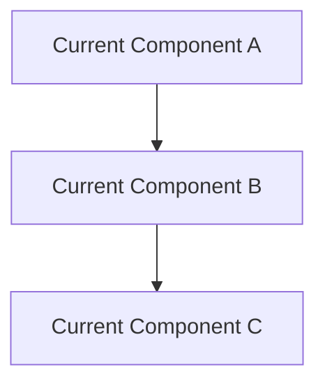
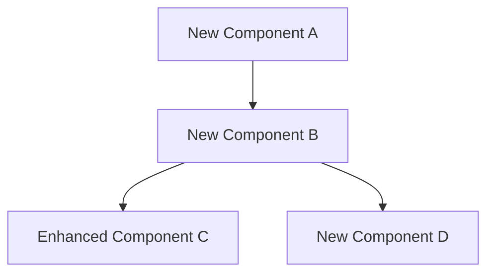

## 📋 Architectural Review Request

### Overview
**Brief Description**: [Provide a concise summary of the proposed architectural change]

**Impact Level**: 
- [ ] Low (Minor changes, no external impact)
- [ ] Medium (Moderate changes, affects multiple components)
- [ ] High (Major changes, affects system architecture)
- [ ] Critical (Fundamental changes, affects entire system)

### Problem Statement
**Current State**: [Describe the current architecture and its limitations]

**Problem**: [Clearly articulate the problem that needs to be solved]

**Business Impact**: [Explain the business impact of not addressing this issue]

### Proposed Solution
**Architecture Overview**: [Provide a high-level overview of the proposed solution]

**Key Components**: 
- [List the main components involved]
- [Include any new services or technologies]
- [Mention integrations with existing systems]

**Technical Approach**: [Describe the technical implementation approach]

### Architecture Diagrams
**Current Architecture**: 

**Proposed Architecture**: 

### Design Decisions
| Decision | Options Considered | Chosen Option | Rationale |
|----------|-------------------|---------------|-----------|
| [Decision 1] | [Option A, Option B] | [Option A] | [Reasoning] |
| [Decision 2] | [Option X, Option Y] | [Option Y] | [Reasoning] |

### Non-Functional Requirements
**Performance**: 
- [ ] Response time requirements: [Specify targets]
- [ ] Throughput requirements: [Specify targets]
- [ ] Scalability requirements: [Specify targets]

**Security**: 
- [ ] Authentication/Authorization changes: [Describe]
- [ ] Data encryption requirements: [Describe]
- [ ] Compliance requirements: [List standards]

**Reliability**: 
- [ ] Availability requirements: [Specify SLA]
- [ ] Disaster recovery requirements: [Specify RTO/RPO]
- [ ] Error handling strategy: [Describe]

### Implementation Plan
**Phase 1**: [Describe initial implementation phase]
- [ ] [Task 1]
- [ ] [Task 2]
- [ ] [Task 3]

**Phase 2**: [Describe second phase]
- [ ] [Task 1]
- [ ] [Task 2]

**Phase 3**: [Describe final phase]
- [ ] [Task 1]
- [ ] [Task 2]

### Risk Assessment
| Risk | Probability | Impact | Mitigation Strategy |
|------|-------------|--------|-------------------|
| [Risk 1] | [High/Medium/Low] | [High/Medium/Low] | [Mitigation approach] |
| [Risk 2] | [High/Medium/Low] | [High/Medium/Low] | [Mitigation approach] |

### Migration Strategy
**Migration Approach**: 
- [ ] Big Bang (Complete replacement)
- [ ] Phased Migration (Gradual rollout)
- [ ] Parallel Running (Run old and new simultaneously)
- [ ] Blue-Green Deployment

**Rollback Plan**: [Describe how to rollback if issues occur]

**Data Migration**: [Describe data migration requirements and approach]

### Testing Strategy
**Testing Approach**: 
- [ ] Unit tests for new components
- [ ] Integration tests for component interactions
- [ ] End-to-end tests for user workflows
- [ ] Performance tests for scalability
- [ ] Security tests for vulnerabilities

**Test Environment**: [Describe test environment requirements]

### Alternatives Considered
**Alternative 1**: [Describe alternative approach]
- **Pros**: [List advantages]
- **Cons**: [List disadvantages]
- **Why Not Chosen**: [Explain reasoning]

**Alternative 2**: [Describe alternative approach]
- **Pros**: [List advantages]
- **Cons**: [List disadvantages]
- **Why Not Chosen**: [Explain reasoning]

### Dependencies
**External Dependencies**: 
- [ ] [Dependency 1]: [Description and impact]
- [ ] [Dependency 2]: [Description and impact]

**Internal Dependencies**: 
- [ ] [Team/Component 1]: [Description and impact]
- [ ] [Team/Component 2]: [Description and impact]

### Resource Requirements
**Development Resources**: 
- [ ] Backend developers: [Number and duration]
- [ ] Frontend developers: [Number and duration]
- [ ] DevOps engineers: [Number and duration]
- [ ] Architects: [Number and duration]

**Infrastructure Resources**: 
- [ ] Additional cloud resources: [Describe]
- [ ] Third-party services: [Describe]
- [ ] Licensing requirements: [Describe]

### Success Criteria
**Technical Success Metrics**: 
- [ ] [Metric 1]: [Target value]
- [ ] [Metric 2]: [Target value]
- [ ] [Metric 3]: [Target value]

**Business Success Metrics**: 
- [ ] [Metric 1]: [Target value]
- [ ] [Metric 2]: [Target value]
- [ ] [Metric 3]: [Target value]

### Documentation Updates
**Documentation Impact**: 
- [ ] Architecture documentation updates required
- [ ] API documentation updates required
- [ ] Deployment guide updates required
- [ ] Troubleshooting guide updates required

### Timeline
**Estimated Timeline**: [Provide overall timeline]

**Key Milestones**: 
- [ ] [Milestone 1]: [Date]
- [ ] [Milestone 2]: [Date]
- [ ] [Milestone 3]: [Date]

### Stakeholder Review
**Required Approvals**: 
- [ ] Technical Architect
- [ ] Security Architect
- [ ] Platform Team
- [ ] Product Owner
- [ ] Engineering Manager

### Additional Context
[Add any additional context, screenshots, research findings, or other relevant information]

---

**Review Checklist for Reviewers:**
- [ ] Architecture aligns with enterprise standards
- [ ] Security considerations are adequate
- [ ] Performance requirements are realistic
- [ ] Implementation plan is feasible
- [ ] Risk assessment is comprehensive
- [ ] Migration strategy is sound
- [ ] Testing strategy is adequate
- [ ] Documentation requirements are clear
