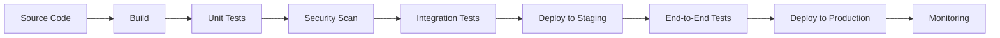

# CI/CD Documentation Templates

## Overview
CI/CD templates optimized for both AI assistance and human workflow. These templates provide structured approaches to continuous integration, continuous deployment, and DevOps practices while enabling AI to understand context and generate relevant pipeline configurations, deployment scripts, and automation documentation.

## AI-Optimized CI/CD Prompts

### Primary CI/CD Prompt Template
```markdown
@copilot I need to create CI/CD pipeline for [PROJECT/APPLICATION].

Context:
- Technology stack: [TECH_STACK]
- Deployment target: [CLOUD_PLATFORM_ENVIRONMENT]
- Testing requirements: [TESTING_STRATEGY]
- Security requirements: [SECURITY_CONTROLS]
- Compliance requirements: [COMPLIANCE_STANDARDS]

Please generate [DELIVERABLE_TYPE] following DevOps best practices.
```

### Specific CI/CD Prompt Templates

#### Pipeline Configuration
```markdown
@copilot Create CI/CD pipeline for [APPLICATION_NAME].

Context:
- Source control: [GIT_REPOSITORY]
- Build system: [BUILD_TOOLS]
- Testing framework: [TESTING_TOOLS]
- Deployment target: [DEPLOYMENT_ENVIRONMENT]
- Pipeline platform: [JENKINS_GITHUB_ACTIONS_AZURE_DEVOPS]

Include: Build, test, security scan, deployment, and monitoring stages.
```

#### Deployment Strategy
```markdown
@copilot Design deployment strategy for [APPLICATION/SERVICE].

Context:
- Application architecture: [MICROSERVICES_MONOLITH]
- Infrastructure: [KUBERNETES_SERVERLESS_VMS]
- Deployment requirements: [ZERO_DOWNTIME_ROLLBACK]
- Environment strategy: [DEV_STAGING_PROD]
- Monitoring requirements: [OBSERVABILITY_NEEDS]

Include: Deployment patterns, rollback procedures, and monitoring setup.
```

#### Infrastructure as Code
```markdown
@copilot Create infrastructure as code for [SYSTEM_COMPONENT].

Context:
- Cloud platform: [AWS_AZURE_GCP]
- Infrastructure requirements: [COMPUTE_STORAGE_NETWORK]
- Scalability needs: [SCALING_REQUIREMENTS]
- Security requirements: [SECURITY_CONSTRAINTS]
- Compliance requirements: [REGULATORY_STANDARDS]

Include: Resource definitions, security configurations, and scaling policies.
```

## Template Documents

### 1. CI/CD Pipeline Template
Comprehensive CI/CD pipeline documentation:

```markdown
# CI/CD Pipeline: [Project/Application Name]

## Document Information
- **Version**: [Version number]
- **Author**: [Author name]
- **Date**: [Creation date]
- **Status**: [Draft/Review/Approved]
- **Pipeline Platform**: [CI/CD platform]

## Pipeline Overview

### Pipeline Purpose
[Description of what the pipeline accomplishes]

### Pipeline Objectives
- **Automation**: [Automated build, test, and deployment]
- **Quality**: [Consistent quality gates]
- **Security**: [Security scanning and compliance]
- **Reliability**: [Reliable and repeatable deployments]
- **Speed**: [Fast feedback and deployment cycles]

### Pipeline Architecture


## Pipeline Configuration

### Source Control Integration
- **Repository**: [Git repository URL]
- **Branching Strategy**: [GitFlow, GitHub Flow, etc.]
- **Triggers**: [Push, pull request, schedule]
- **Webhook Configuration**: [Automated triggers]

### Build Configuration
#### Build Environment
```yaml
# Example GitHub Actions configuration
name: CI/CD Pipeline

on:
  push:
    branches: [main, develop]
  pull_request:
    branches: [main]

jobs:
  build:
    runs-on: ubuntu-latest
    
    steps:
    - uses: actions/checkout@v3
    
    - name: Set up Node.js
      uses: actions/setup-node@v3
      with:
        node-version: '18'
        cache: 'npm'
    
    - name: Install dependencies
      run: npm ci
    
    - name: Build application
      run: npm run build
    
    - name: Run unit tests
      run: npm run test:unit
    
    - name: Run integration tests
      run: npm run test:integration
```

#### Build Steps
1. **Code Checkout**: [Source code retrieval]
2. **Environment Setup**: [Build environment configuration]
3. **Dependency Installation**: [Package installation]
4. **Code Compilation**: [Build process]
5. **Artifact Creation**: [Deployable artifact generation]

### Testing Configuration
#### Test Stages
- **Unit Tests**: [Individual component testing]
- **Integration Tests**: [Component interaction testing]
- **End-to-End Tests**: [Full system testing]
- **Performance Tests**: [Load and stress testing]
- **Security Tests**: [Security vulnerability testing]

#### Test Configuration
```yaml
test:
  needs: build
  runs-on: ubuntu-latest
  
  steps:
  - uses: actions/checkout@v3
  
  - name: Set up test environment
    run: |
      docker-compose up -d
      sleep 30
  
  - name: Run unit tests
    run: npm run test:unit -- --coverage
  
  - name: Run integration tests
    run: npm run test:integration
  
  - name: Run security tests
    run: npm run test:security
  
  - name: Generate test reports
    run: npm run test:report
  
  - name: Upload test results
    uses: actions/upload-artifact@v3
    with:
      name: test-results
      path: test-results/
```

### Quality Gates
#### Code Quality
- **Code Coverage**: [Minimum 80% coverage]
- **Code Quality**: [SonarQube quality gates]
- **Security Scan**: [No critical vulnerabilities]
- **Dependency Check**: [No known vulnerable dependencies]

#### Quality Gate Configuration
```yaml
quality-gate:
  needs: test
  runs-on: ubuntu-latest
  
  steps:
  - name: SonarCloud Scan
    uses: SonarSource/sonarcloud-github-action@master
    env:
      GITHUB_TOKEN: ${{ secrets.GITHUB_TOKEN }}
      SONAR_TOKEN: ${{ secrets.SONAR_TOKEN }}
  
  - name: Security Scan
    run: npm audit --audit-level high
  
  - name: Dependency Check
    uses: dependency-check/Dependency-Check_Action@main
    with:
      project: 'project-name'
      path: '.'
      format: 'ALL'
```

### Deployment Configuration
#### Environment Strategy
- **Development**: [Feature development and testing]
- **Staging**: [Pre-production testing]
- **Production**: [Live environment]

#### Deployment Stages
```yaml
deploy-staging:
  needs: quality-gate
  runs-on: ubuntu-latest
  if: github.ref == 'refs/heads/develop'
  
  steps:
  - name: Deploy to Staging
    run: |
      echo "Deploying to staging environment"
      # Deployment commands
  
  - name: Run smoke tests
    run: npm run test:smoke -- --env=staging
  
  - name: Health check
    run: |
      curl -f http://staging.example.com/health || exit 1

deploy-production:
  needs: deploy-staging
  runs-on: ubuntu-latest
  if: github.ref == 'refs/heads/main'
  environment: production
  
  steps:
  - name: Deploy to Production
    run: |
      echo "Deploying to production environment"
      # Deployment commands
  
  - name: Run production smoke tests
    run: npm run test:smoke -- --env=production
  
  - name: Health check
    run: |
      curl -f http://production.example.com/health || exit 1
```

## Deployment Strategy

### Deployment Patterns
#### Blue-Green Deployment
- **Blue Environment**: [Current production]
- **Green Environment**: [New version staging]
- **Traffic Switch**: [Instant traffic cutover]
- **Rollback**: [Immediate rollback capability]

#### Canary Deployment
- **Canary Release**: [Small percentage of traffic]
- **Monitoring**: [Performance and error monitoring]
- **Gradual Rollout**: [Incremental traffic increase]
- **Rollback**: [Automatic rollback on issues]

#### Rolling Deployment
- **Instance Replacement**: [Gradual instance updates]
- **Health Checks**: [Continuous health monitoring]
- **Load Balancing**: [Traffic distribution during update]
- **Rollback**: [Instance-level rollback]

### Deployment Scripts
#### Kubernetes Deployment
```yaml
# deployment.yaml
apiVersion: apps/v1
kind: Deployment
metadata:
  name: app-deployment
  labels:
    app: myapp
spec:
  replicas: 3
  selector:
    matchLabels:
      app: myapp
  template:
    metadata:
      labels:
        app: myapp
    spec:
      containers:
      - name: myapp
        image: myapp:latest
        ports:
        - containerPort: 3000
        env:
        - name: NODE_ENV
          value: "production"
        livenessProbe:
          httpGet:
            path: /health
            port: 3000
          initialDelaySeconds: 30
          periodSeconds: 10
        readinessProbe:
          httpGet:
            path: /ready
            port: 3000
          initialDelaySeconds: 5
          periodSeconds: 5
```

#### Docker Compose
```yaml
# docker-compose.prod.yml
version: '3.8'
services:
  app:
    image: myapp:${VERSION}
    ports:
      - "3000:3000"
    environment:
      - NODE_ENV=production
      - DATABASE_URL=${DATABASE_URL}
    depends_on:
      - db
    restart: unless-stopped
    
  db:
    image: postgres:14
    environment:
      - POSTGRES_DB=${DB_NAME}
      - POSTGRES_USER=${DB_USER}
      - POSTGRES_PASSWORD=${DB_PASSWORD}
    volumes:
      - postgres_data:/var/lib/postgresql/data
    restart: unless-stopped

volumes:
  postgres_data:
```

## Infrastructure as Code

### Terraform Configuration
#### Main Infrastructure
```hcl
# main.tf
terraform {
  required_providers {
    aws = {
      source  = "hashicorp/aws"
      version = "~> 5.0"
    }
  }
}

provider "aws" {
  region = var.aws_region
}

# VPC Configuration
module "vpc" {
  source = "terraform-aws-modules/vpc/aws"
  
  name = "${var.project_name}-vpc"
  cidr = var.vpc_cidr
  
  azs             = var.availability_zones
  private_subnets = var.private_subnets
  public_subnets  = var.public_subnets
  
  enable_nat_gateway = true
  enable_vpn_gateway = true
  
  tags = {
    Environment = var.environment
    Project     = var.project_name
  }
}

# ECS Cluster
resource "aws_ecs_cluster" "main" {
  name = "${var.project_name}-cluster"
  
  setting {
    name  = "containerInsights"
    value = "enabled"
  }
  
  tags = {
    Environment = var.environment
    Project     = var.project_name
  }
}

# Application Load Balancer
resource "aws_lb" "main" {
  name               = "${var.project_name}-alb"
  internal           = false
  load_balancer_type = "application"
  security_groups    = [aws_security_group.alb.id]
  subnets            = module.vpc.public_subnets
  
  enable_deletion_protection = var.environment == "production"
  
  tags = {
    Environment = var.environment
    Project     = var.project_name
  }
}
```

#### Variables
```hcl
# variables.tf
variable "project_name" {
  description = "Name of the project"
  type        = string
  default     = "myapp"
}

variable "environment" {
  description = "Environment name"
  type        = string
}

variable "aws_region" {
  description = "AWS region"
  type        = string
  default     = "us-west-2"
}

variable "vpc_cidr" {
  description = "CIDR block for VPC"
  type        = string
  default     = "10.0.0.0/16"
}

variable "availability_zones" {
  description = "Availability zones"
  type        = list(string)
  default     = ["us-west-2a", "us-west-2b", "us-west-2c"]
}
```

### Ansible Playbook
```yaml
# deploy.yml
---
- name: Deploy application
  hosts: web_servers
  become: yes
  vars:
    app_name: myapp
    app_version: "{{ version | default('latest') }}"
    app_port: 3000
    
  tasks:
    - name: Pull Docker image
      docker_image:
        name: "{{ app_name }}:{{ app_version }}"
        source: pull
        
    - name: Stop existing container
      docker_container:
        name: "{{ app_name }}"
        state: stopped
      ignore_errors: yes
      
    - name: Remove existing container
      docker_container:
        name: "{{ app_name }}"
        state: absent
      ignore_errors: yes
      
    - name: Start new container
      docker_container:
        name: "{{ app_name }}"
        image: "{{ app_name }}:{{ app_version }}"
        state: started
        ports:
          - "{{ app_port }}:{{ app_port }}"
        env:
          NODE_ENV: production
          DATABASE_URL: "{{ database_url }}"
        restart_policy: unless-stopped
        
    - name: Wait for application to be ready
      uri:
        url: "http://localhost:{{ app_port }}/health"
        method: GET
        status_code: 200
      register: result
      until: result.status == 200
      retries: 30
      delay: 10
```

## Monitoring and Observability

### Monitoring Strategy
- **Infrastructure Monitoring**: [Server metrics, resource usage]
- **Application Monitoring**: [Application performance, errors]
- **Business Monitoring**: [Business metrics, KPIs]
- **Security Monitoring**: [Security events, compliance]

### Monitoring Configuration
#### Prometheus Configuration
```yaml
# prometheus.yml
global:
  scrape_interval: 15s
  evaluation_interval: 15s

rule_files:
  - "alert_rules.yml"

scrape_configs:
  - job_name: 'app'
    static_configs:
      - targets: ['app:3000']
    metrics_path: '/metrics'
    scrape_interval: 5s
    
  - job_name: 'node-exporter'
    static_configs:
      - targets: ['node-exporter:9100']
      
alerting:
  alertmanagers:
    - static_configs:
        - targets:
          - alertmanager:9093
```

#### Grafana Dashboard
```json
{
  "dashboard": {
    "title": "Application Dashboard",
    "panels": [
      {
        "title": "Request Rate",
        "type": "graph",
        "targets": [
          {
            "expr": "rate(http_requests_total[5m])",
            "legendFormat": "{{method}} {{status}}"
          }
        ]
      },
      {
        "title": "Response Time",
        "type": "graph",
        "targets": [
          {
            "expr": "histogram_quantile(0.95, http_request_duration_seconds_bucket)",
            "legendFormat": "95th percentile"
          }
        ]
      }
    ]
  }
}
```

### Alerting Configuration
```yaml
# alert_rules.yml
groups:
  - name: application
    rules:
      - alert: HighErrorRate
        expr: rate(http_requests_total{status=~"5.."}[5m]) > 0.1
        for: 5m
        labels:
          severity: critical
        annotations:
          summary: "High error rate detected"
          description: "Error rate is {{ $value }} requests per second"
          
      - alert: HighResponseTime
        expr: histogram_quantile(0.95, http_request_duration_seconds_bucket) > 0.5
        for: 5m
        labels:
          severity: warning
        annotations:
          summary: "High response time detected"
          description: "95th percentile response time is {{ $value }} seconds"
```

## Security and Compliance

### Security Controls
#### Pipeline Security
- **Code Scanning**: [Static code analysis]
- **Dependency Scanning**: [Vulnerability scanning]
- **Container Scanning**: [Image vulnerability scanning]
- **Secrets Management**: [Secure credential handling]

#### Security Configuration
```yaml
security-scan:
  runs-on: ubuntu-latest
  
  steps:
  - uses: actions/checkout@v3
  
  - name: Run CodeQL Analysis
    uses: github/codeql-action/analyze@v2
    with:
      languages: javascript
      
  - name: Run Snyk Security Scan
    uses: snyk/actions/node@master
    env:
      SNYK_TOKEN: ${{ secrets.SNYK_TOKEN }}
    with:
      args: --severity-threshold=high
      
  - name: Scan Docker image
    uses: aquasecurity/trivy-action@master
    with:
      image-ref: 'myapp:latest'
      format: 'sarif'
      output: 'trivy-results.sarif'
```

### Compliance Requirements
#### SOC 2 Compliance
- **Access Control**: [User access management]
- **Change Management**: [Controlled deployments]
- **Monitoring**: [Continuous monitoring]
- **Incident Response**: [Security incident procedures]

#### GDPR Compliance
- **Data Protection**: [Data encryption, access controls]
- **Privacy by Design**: [Privacy-first development]
- **Audit Logging**: [Comprehensive audit trails]
- **Right to be Forgotten**: [Data deletion capabilities]

## Disaster Recovery

### Backup Strategy
- **Data Backup**: [Regular data backups]
- **Configuration Backup**: [Infrastructure configuration]
- **Code Backup**: [Source code repositories]
- **Documentation Backup**: [Operational documentation]

### Recovery Procedures
#### Database Recovery
```bash
#!/bin/bash
# Database recovery script

# Restore from backup
pg_restore -h $DB_HOST -U $DB_USER -d $DB_NAME $BACKUP_FILE

# Verify restoration
psql -h $DB_HOST -U $DB_USER -d $DB_NAME -c "SELECT COUNT(*) FROM users;"

# Update application configuration
kubectl set env deployment/app DATABASE_URL=$NEW_DATABASE_URL
```

#### Application Recovery
```bash
#!/bin/bash
# Application recovery script

# Rollback to previous version
kubectl rollout undo deployment/app

# Verify rollback
kubectl rollout status deployment/app

# Check application health
curl -f http://app.example.com/health
```

## Performance Optimization

### Pipeline Optimization
- **Build Caching**: [Dependency and build caching]
- **Parallel Execution**: [Concurrent pipeline stages]
- **Resource Optimization**: [Efficient resource usage]
- **Artifact Management**: [Efficient artifact handling]

### Deployment Optimization
- **Container Optimization**: [Minimal container images]
- **Network Optimization**: [CDN, caching strategies]
- **Database Optimization**: [Query optimization, indexing]
- **Application Optimization**: [Code optimization, profiling]

## Documentation and Training

### Documentation Requirements
- **Pipeline Documentation**: [Pipeline configuration and procedures]
- **Deployment Documentation**: [Deployment procedures and rollback]
- **Monitoring Documentation**: [Monitoring setup and procedures]
- **Incident Response**: [Incident response procedures]

### Training Materials
- **Developer Training**: [Pipeline usage and best practices]
- **Operations Training**: [Deployment and monitoring procedures]
- **Security Training**: [Security practices and compliance]
- **Incident Response Training**: [Emergency response procedures]

## Appendices

### Appendix A: Pipeline Examples
- **Simple Web App**: [Basic pipeline configuration]
- **Microservices**: [Multi-service pipeline]
- **Mobile App**: [Mobile-specific pipeline]
- **Database Changes**: [Database migration pipeline]

### Appendix B: Tools and Technologies
- **CI/CD Platforms**: [Jenkins, GitHub Actions, GitLab CI]
- **Container Platforms**: [Docker, Kubernetes, OpenShift]
- **Cloud Platforms**: [AWS, Azure, GCP]
- **Monitoring Tools**: [Prometheus, Grafana, ELK Stack]

### Appendix C: Best Practices
- **Pipeline Design**: [Design principles and patterns]
- **Security**: [Security best practices]
- **Performance**: [Performance optimization]
- **Troubleshooting**: [Common issues and solutions]

### Appendix D: Checklists
- **Pipeline Setup**: [Initial setup checklist]
- **Deployment**: [Deployment verification checklist]
- **Monitoring**: [Monitoring setup checklist]
- **Security**: [Security validation checklist]
```

### 2. Deployment Strategy Template
Specific deployment strategy documentation:

```markdown
# Deployment Strategy: [Application/Service Name]

## Strategy Overview
- **Deployment Pattern**: [Blue-Green/Canary/Rolling]
- **Target Environment**: [Cloud platform and services]
- **Rollback Strategy**: [Rollback procedures]
- **Monitoring Strategy**: [Deployment monitoring]

## Environment Configuration
### Production Environment
- **Infrastructure**: [Servers, containers, services]
- **Scaling**: [Auto-scaling configuration]
- **Load Balancing**: [Traffic distribution]
- **Security**: [Security configurations]

### Staging Environment
- **Purpose**: [Pre-production testing]
- **Configuration**: [Environment setup]
- **Data**: [Test data strategy]
- **Testing**: [Testing procedures]

## Deployment Procedures
### Pre-Deployment
- [ ] Code review completed
- [ ] Tests passing
- [ ] Security scan passed
- [ ] Backup created
- [ ] Rollback plan ready

### Deployment Steps
1. **Traffic Drain**: [Redirect traffic from target servers]
2. **Service Update**: [Deploy new version]
3. **Health Check**: [Verify service health]
4. **Smoke Test**: [Basic functionality test]
5. **Traffic Restore**: [Restore traffic to updated servers]

### Post-Deployment
- [ ] Monitoring alerts configured
- [ ] Performance metrics checked
- [ ] User acceptance testing
- [ ] Documentation updated
- [ ] Team notification

## Rollback Procedures
### Automatic Rollback
- **Trigger Conditions**: [Health check failures, error rates]
- **Rollback Actions**: [Automated rollback steps]
- **Notification**: [Alert stakeholders]

### Manual Rollback
- **Decision Criteria**: [When to manually rollback]
- **Rollback Steps**: [Manual rollback procedures]
- **Validation**: [Verify rollback success]

## Monitoring and Alerting
### Deployment Monitoring
- **Deployment Metrics**: [Success rate, duration]
- **Application Metrics**: [Performance, errors]
- **Infrastructure Metrics**: [Resource usage]

### Alert Configuration
- **Critical Alerts**: [Immediate notification]
- **Warning Alerts**: [Monitoring alerts]
- **Information Alerts**: [Status updates]
```

### 3. Pipeline Template
CI/CD pipeline configuration template:

```markdown
# Pipeline Configuration: [Pipeline Name]

## Pipeline Overview
- **Purpose**: [Pipeline objectives]
- **Triggers**: [What triggers the pipeline]
- **Stages**: [Pipeline stages overview]
- **Duration**: [Expected pipeline duration]

## Stage Configuration
### Build Stage
- **Environment**: [Build environment]
- **Dependencies**: [Build dependencies]
- **Steps**: [Build process steps]
- **Artifacts**: [Generated artifacts]

### Test Stage
- **Test Types**: [Unit, integration, e2e tests]
- **Test Environment**: [Test environment setup]
- **Test Data**: [Test data requirements]
- **Coverage**: [Test coverage requirements]

### Deploy Stage
- **Environment**: [Deployment target]
- **Strategy**: [Deployment strategy]
- **Validation**: [Deployment validation]
- **Rollback**: [Rollback procedures]

## Quality Gates
### Code Quality
- **Code Coverage**: [Minimum coverage percentage]
- **Code Quality**: [Quality metrics]
- **Security**: [Security scan requirements]
- **Performance**: [Performance benchmarks]

### Approval Gates
- **Automated Approval**: [Automated approval criteria]
- **Manual Approval**: [Manual approval requirements]
- **Approval Matrix**: [Who can approve what]
```

## Process Workflow

### 1. CI/CD Planning
```markdown
## CI/CD Planning Checklist
- [ ] Requirements defined
- [ ] Pipeline strategy selected
- [ ] Tools and platforms chosen
- [ ] Security requirements identified
- [ ] Monitoring strategy defined
- [ ] Rollback procedures planned
```

### 2. Pipeline Implementation
```markdown
## Pipeline Implementation Checklist
- [ ] Pipeline configured
- [ ] Quality gates implemented
- [ ] Security controls added
- [ ] Monitoring setup
- [ ] Documentation created
- [ ] Team training completed
```

### 3. Operations and Maintenance
```markdown
## Operations Checklist
- [ ] Pipeline monitoring active
- [ ] Performance metrics tracked
- [ ] Security compliance verified
- [ ] Incident response ready
- [ ] Regular pipeline reviews
- [ ] Continuous improvement
```

## Integration with Development

### DevOps Culture
```markdown
## DevOps Best Practices
- Continuous integration and deployment
- Infrastructure as code
- Monitoring and observability
- Collaboration and communication
- Automation and tooling
- Continuous learning and improvement
```

### Collaboration with AI
```markdown
## AI Collaboration Best Practices
- Provide complete infrastructure context
- Include deployment requirements
- Specify platform constraints
- Reference DevOps standards
- Request automation scripts
- Validate generated configurations
```

## Tools and Resources

### CI/CD Platforms
- **Jenkins**: [Open-source automation server]
- **GitHub Actions**: [GitHub-native CI/CD]
- **GitLab CI**: [GitLab-integrated CI/CD]
- **Azure DevOps**: [Microsoft DevOps platform]

### Container Platforms
- **Docker**: [Container runtime]
- **Kubernetes**: [Container orchestration]
- **OpenShift**: [Enterprise Kubernetes]

### Cloud Platforms
- **AWS**: [Amazon Web Services]
- **Azure**: [Microsoft Azure]
- **GCP**: [Google Cloud Platform]

### Monitoring Tools
- **Prometheus**: [Metrics collection]
- **Grafana**: [Metrics visualization]
- **ELK Stack**: [Logging and analysis]
- **Datadog**: [Monitoring and analytics]

---

**Note**: These templates are designed to work with GitHub Copilot and should be customized based on your specific CI/CD platform, deployment targets, and organizational requirements.
