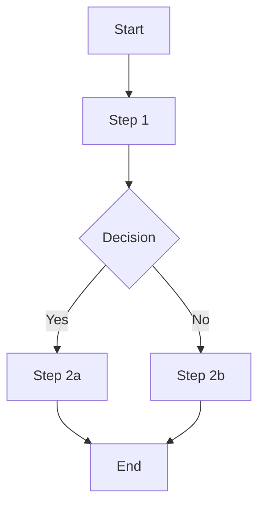

# Function Design Documentation Templates

## Overview
Functional design templates optimized for both AI assistance and human workflow. These templates provide structured approaches to capturing business requirements, user stories, and acceptance criteria while enabling AI to understand context and generate relevant functional specifications.

## AI-Optimized Function Design Prompts

### Primary Function Design Prompt Template
```markdown
@copilot I need to create functional documentation for [FEATURE/COMPONENT].

Context:
- Business objective: [BUSINESS_GOAL]
- User roles: [PRIMARY_USERS]
- Current state: [EXISTING_FUNCTIONALITY]
- Success criteria: [ACCEPTANCE_CRITERIA]
- Dependencies: [RELATED_SYSTEMS]

Please generate [DELIVERABLE_TYPE] following functional design best practices.
```

### Specific Function Design Prompt Templates

#### User Story Creation
```markdown
@copilot Create user stories for [FEATURE_NAME].

Context:
- User personas: [PERSONA_NAMES]
- Business value: [VALUE_PROPOSITION]
- Constraints: [TECHNICAL_BUSINESS_LIMITS]
- Priority: [HIGH/MEDIUM/LOW]

Include: User stories, acceptance criteria, and definition of done.
Format: As a [USER], I want [GOAL] so that [BENEFIT].
```

#### Acceptance Criteria Definition
```markdown
@copilot Define acceptance criteria for [USER_STORY].

Context:
- User story: [COMPLETE_USER_STORY]
- Business rules: [APPLICABLE_RULES]
- Edge cases: [KNOWN_EDGE_CASES]
- Success metrics: [MEASURABLE_OUTCOMES]

Include: Given-When-Then scenarios, validation rules, and error handling.
```

#### Functional Specification
```markdown
@copilot Create a functional specification for [FEATURE/MODULE].

Context:
- Business requirements: [REQUIREMENTS_LIST]
- User workflows: [PROCESS_FLOWS]
- Data requirements: [DATA_NEEDS]
- Integration points: [EXTERNAL_SYSTEMS]

Include: Detailed functionality, business rules, data flows, and validation requirements.
```

## Template Documents

### 1. User Story Template
Structure for capturing user requirements:

```markdown
# User Story: [Story Title]

## Story Overview
- **Epic**: [Parent epic name]
- **Priority**: [High/Medium/Low]
- **Story Points**: [Estimation]
- **Sprint**: [Target sprint]

## User Story
**As a** [type of user]  
**I want** [goal/desire]  
**So that** [benefit/value]

## Acceptance Criteria

### Scenario 1: [Happy Path]
**Given** [initial context]  
**When** [action is performed]  
**Then** [expected outcome]

### Scenario 2: [Alternative Path]
**Given** [initial context]  
**When** [action is performed]  
**Then** [expected outcome]

### Scenario 3: [Error Case]
**Given** [initial context]  
**When** [action is performed]  
**Then** [expected outcome]

## Business Rules
- [Rule 1]: [Description and rationale]
- [Rule 2]: [Description and rationale]
- [Rule 3]: [Description and rationale]

## Definition of Done
- [ ] Code implemented and tested
- [ ] Unit tests pass (>90% coverage)
- [ ] Integration tests pass
- [ ] Code review completed
- [ ] Documentation updated
- [ ] Acceptance criteria verified
- [ ] Performance requirements met
- [ ] Security review completed
- [ ] Accessibility requirements met
- [ ] Deployed to staging environment

## Dependencies
- **Upstream**: [Stories that must be completed first]
- **Downstream**: [Stories that depend on this one]
- **External**: [External team dependencies]

## Assumptions
- [Assumption 1]: [Description and validation needed]
- [Assumption 2]: [Description and validation needed]

## Questions/Risks
- [Question 1]: [Outstanding question]
- [Risk 1]: [Potential risk and mitigation]

## Mockups/Wireframes
[Link to design documents or embed images]

## Technical Notes
[Any technical considerations or constraints]
```

### 2. Acceptance Criteria Template
Detailed structure for acceptance criteria:

```markdown
# Acceptance Criteria: [Feature/Story Name]

## Overview
- **Feature**: [Feature name]
- **User Story**: [Link to user story]
- **Priority**: [High/Medium/Low]
- **Complexity**: [Simple/Medium/Complex]

## Functional Requirements

### Core Functionality
#### Requirement 1: [Requirement Name]
**Given** [precondition]  
**When** [action]  
**Then** [expected result]

**Validation Rules:**
- [Rule 1]: [Specific validation requirement]
- [Rule 2]: [Specific validation requirement]

#### Requirement 2: [Requirement Name]
[Repeat structure...]

### User Interface Requirements
- **Layout**: [UI layout requirements]
- **Navigation**: [Navigation behavior]
- **Responsiveness**: [Mobile/tablet/desktop requirements]
- **Accessibility**: [A11y requirements]

### Data Requirements
- **Input Validation**: [Data format requirements]
- **Storage**: [Data persistence requirements]
- **Processing**: [Data transformation requirements]
- **Output**: [Data display requirements]

### Performance Requirements
- **Response Time**: [Maximum acceptable time]
- **Throughput**: [Requests per second]
- **Availability**: [Uptime requirements]
- **Scalability**: [Growth expectations]

### Security Requirements
- **Authentication**: [Auth requirements]
- **Authorization**: [Permission requirements]
- **Data Protection**: [Privacy requirements]
- **Audit**: [Logging requirements]

## Edge Cases

### Edge Case 1: [Case Name]
**Scenario**: [Description]  
**Expected Behavior**: [How system should respond]

### Edge Case 2: [Case Name]
**Scenario**: [Description]  
**Expected Behavior**: [How system should respond]

## Error Handling

### Error Type 1: [Error Category]
**Trigger**: [What causes the error]  
**User Experience**: [How error is presented]  
**System Behavior**: [What system does]  
**Recovery**: [How user can recover]

### Error Type 2: [Error Category]
[Repeat structure...]

## Integration Requirements
- **API Endpoints**: [Required integrations]
- **Data Sources**: [External data requirements]
- **Third-party Services**: [External service dependencies]

## Testing Scenarios

### Test Scenario 1: [Test Name]
**Objective**: [What to test]  
**Steps**: [Test steps]  
**Expected Result**: [Expected outcome]

### Test Scenario 2: [Test Name]
[Repeat structure...]

## Approval Criteria
- [ ] Business stakeholder approval
- [ ] Technical lead approval
- [ ] UX/UI approval
- [ ] Security approval
- [ ] Performance approval
```

### 3. Functional Specification Template
Comprehensive functional documentation:

```markdown
# Functional Specification: [Feature/Module Name]

## Document Information
- **Version**: [Version number]
- **Author**: [Author name]
- **Date**: [Creation date]
- **Status**: [Draft/Review/Approved]
- **Approvers**: [List of approvers]

## Executive Summary
[Brief overview of the feature/module and its business value]

## Business Context

### Problem Statement
[Description of the problem this feature solves]

### Business Objectives
- [Objective 1]: [Description and success metrics]
- [Objective 2]: [Description and success metrics]
- [Objective 3]: [Description and success metrics]

### Success Criteria
- [Metric 1]: [Target value]
- [Metric 2]: [Target value]
- [Metric 3]: [Target value]

## Scope

### In Scope
- [Feature 1]: [Description]
- [Feature 2]: [Description]
- [Feature 3]: [Description]

### Out of Scope
- [Excluded item 1]: [Rationale]
- [Excluded item 2]: [Rationale]

### Future Considerations
- [Future feature 1]: [Description and timeline]
- [Future feature 2]: [Description and timeline]

## User Personas and Use Cases

### Primary Users
- **[Persona 1]**: [Description and needs]
- **[Persona 2]**: [Description and needs]

### Use Cases
#### Use Case 1: [Use Case Name]
**Primary Actor**: [User type]  
**Goal**: [What user wants to achieve]  
**Preconditions**: [What must be true before]  
**Success Scenario**: [Step-by-step happy path]  
**Extensions**: [Alternative paths]  
**Postconditions**: [What is true after]

#### Use Case 2: [Use Case Name]
[Repeat structure...]

## Functional Requirements

### Feature 1: [Feature Name]
**Description**: [Detailed description]  
**Priority**: [High/Medium/Low]  
**Complexity**: [Simple/Medium/Complex]

#### Sub-Requirements
- **FR1.1**: [Specific requirement]
- **FR1.2**: [Specific requirement]
- **FR1.3**: [Specific requirement]

### Feature 2: [Feature Name]
[Repeat structure...]

## Business Rules

### Rule Category 1: [Category Name]
- **BR1**: [Business rule description]
- **BR2**: [Business rule description]

### Rule Category 2: [Category Name]
- **BR3**: [Business rule description]
- **BR4**: [Business rule description]

## Data Requirements

### Data Entities
#### Entity 1: [Entity Name]
**Purpose**: [Why this data is needed]  
**Attributes**: [Key attributes]  
**Relationships**: [Relationships to other entities]  
**Constraints**: [Business constraints]

#### Entity 2: [Entity Name]
[Repeat structure...]

### Data Flow
1. [Step 1]: [Data source → transformation → destination]
2. [Step 2]: [Data source → transformation → destination]
3. [Step 3]: [Data source → transformation → destination]

## Process Flows

### Process 1: [Process Name]


### Process 2: [Process Name]
[Include process diagram]

## Integration Requirements

### Internal Integrations
- **System A**: [Integration details]
- **System B**: [Integration details]

### External Integrations
- **Third-party Service A**: [Integration details]
- **Third-party Service B**: [Integration details]

## Non-Functional Requirements

### Performance
- **Response Time**: [Requirement]
- **Throughput**: [Requirement]
- **Concurrent Users**: [Requirement]

### Scalability
- **Growth Projections**: [Expected growth]
- **Scaling Strategy**: [How to scale]

### Security
- **Authentication**: [Requirements]
- **Authorization**: [Requirements]
- **Data Protection**: [Requirements]

### Reliability
- **Availability**: [Uptime requirement]
- **Fault Tolerance**: [Error handling]
- **Disaster Recovery**: [Recovery requirements]

## Assumptions and Dependencies

### Assumptions
- [Assumption 1]: [Description and validation plan]
- [Assumption 2]: [Description and validation plan]

### Dependencies
- [Dependency 1]: [Description and timeline]
- [Dependency 2]: [Description and timeline]

## Risks and Mitigation

### Risk 1: [Risk Description]
**Probability**: [High/Medium/Low]  
**Impact**: [High/Medium/Low]  
**Mitigation**: [Mitigation strategy]

### Risk 2: [Risk Description]
[Repeat structure...]

## Implementation Phases

### Phase 1: [Phase Name]
**Scope**: [What's included]  
**Timeline**: [Expected duration]  
**Dependencies**: [Phase dependencies]

### Phase 2: [Phase Name]
[Repeat structure...]

## Appendices

### Appendix A: Glossary
- **Term 1**: [Definition]
- **Term 2**: [Definition]

### Appendix B: References
- [Reference 1]: [Link or citation]
- [Reference 2]: [Link or citation]
```

## Process Workflow

### 1. Requirements Gathering
```markdown
## Requirements Gathering Checklist
- [ ] Stakeholder interviews completed
- [ ] Business objectives defined
- [ ] User personas identified
- [ ] Use cases documented
- [ ] Acceptance criteria defined
- [ ] Non-functional requirements captured
```

### 2. Analysis and Design
```markdown
## Analysis and Design Checklist
- [ ] Requirements analyzed and prioritized
- [ ] User stories created
- [ ] Acceptance criteria detailed
- [ ] Business rules documented
- [ ] Data requirements defined
- [ ] Process flows mapped
```

### 3. Validation and Approval
```markdown
## Validation and Approval Checklist
- [ ] Stakeholder review completed
- [ ] Technical feasibility confirmed
- [ ] Business value validated
- [ ] Acceptance criteria approved
- [ ] Implementation plan agreed
- [ ] Final approval received
```

## Integration with Development

### Handoff to Technical Design
```markdown
## Technical Handoff Checklist
- [ ] Functional requirements documented
- [ ] Business rules clearly defined
- [ ] Data requirements specified
- [ ] Integration needs identified
- [ ] Performance requirements set
- [ ] Security requirements defined
```

### Collaboration with AI
```markdown
## AI Collaboration Best Practices
- Provide complete business context
- Include user personas and use cases
- Specify acceptance criteria clearly
- Reference related requirements
- Request structured outputs
- Validate generated content
```

## Tools and Resources

### Requirements Management
- **Jira**: [Link to project]
- **Azure DevOps**: [Link to work items]
- **Confluence**: [Link to requirements space]

### Documentation Tools
- **Markdown**: [Documentation standards]
- **Mermaid**: [Diagram standards]
- **Lucidchart**: [Process flow tools]

### Collaboration Tools
- **Microsoft Teams**: [Team channels]
- **Slack**: [Communication channels]
- **Workshop Tools**: [Miro, Mural boards]

---

**Note**: These templates are designed to work with GitHub Copilot and should be customized based on your specific project needs and team workflow.
