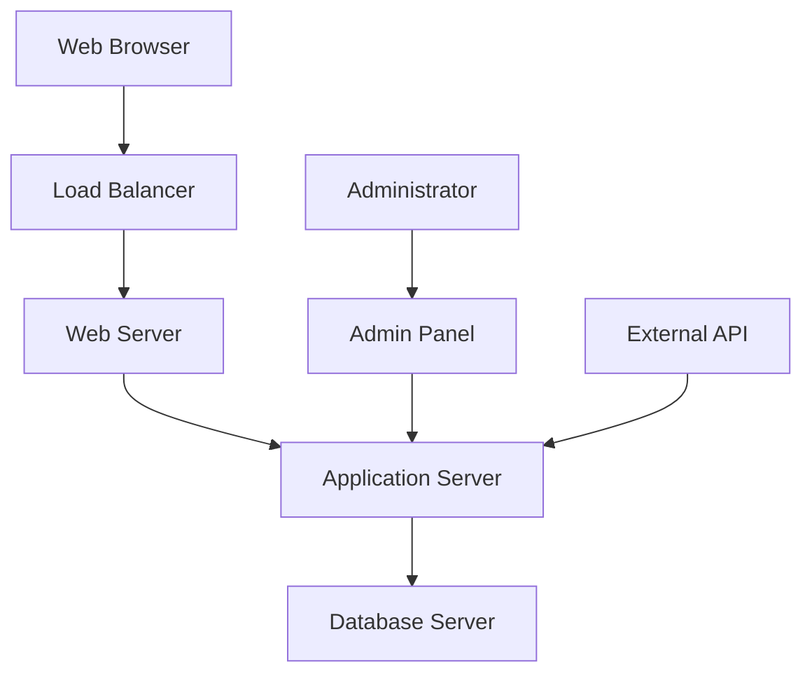
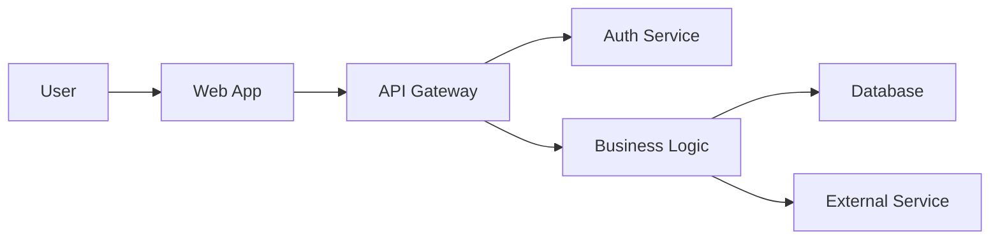

# Security Documentation Templates

## Overview
Security templates optimized for both AI assistance and human workflow. These templates provide structured approaches to security requirements, threat modeling, and security implementation while enabling AI to understand context and generate relevant security documentation, code, and practices.

## AI-Optimized Security Prompts

### Primary Security Prompt Template
```markdown
@copilot I need to create security documentation for [SYSTEM/COMPONENT].

Context:
- System type: [WEB_API_MOBILE_DESKTOP]
- Data classification: [PUBLIC_INTERNAL_CONFIDENTIAL_RESTRICTED]
- Threat landscape: [KNOWN_THREATS]
- Compliance requirements: [REGULATORY_STANDARDS]
- Risk tolerance: [RISK_LEVEL]

Please generate [DELIVERABLE_TYPE] following security best practices.
```

### Specific Security Prompt Templates

#### Threat Modeling
```markdown
@copilot Create threat model for [SYSTEM/FEATURE].

Context:
- System architecture: [ARCHITECTURE_OVERVIEW]
- Data flows: [DATA_MOVEMENT_PATTERNS]
- Trust boundaries: [SECURITY_BOUNDARIES]
- Assets: [CRITICAL_ASSETS]
- Threat actors: [POTENTIAL_ATTACKERS]

Include: Threat identification, attack vectors, impact assessment, and mitigation strategies.
```

#### Security Requirements
```markdown
@copilot Define security requirements for [PROJECT/SYSTEM].

Context:
- Business requirements: [BUSINESS_CONTEXT]
- Regulatory compliance: [COMPLIANCE_STANDARDS]
- Risk assessment: [RISK_ANALYSIS]
- Security objectives: [SECURITY_GOALS]
- Technical constraints: [TECHNICAL_LIMITATIONS]

Include: Authentication, authorization, data protection, and audit requirements.
```

#### Security Implementation
```markdown
@copilot Implement security controls for [SPECIFIC_REQUIREMENT].

Context:
- Technology stack: [TECH_STACK]
- Security requirement: [SPECIFIC_REQUIREMENT]
- Implementation constraints: [CONSTRAINTS]
- Performance requirements: [PERFORMANCE_NEEDS]
- Integration requirements: [INTEGRATION_POINTS]

Include: Code implementation, configuration, testing, and documentation.
```

## Template Documents

### 1. Security Requirements Template
Comprehensive security requirements documentation:

```markdown
# Security Requirements: [System/Project Name]

## Document Information
- **Version**: [Version number]
- **Author**: [Author name]
- **Date**: [Creation date]
- **Status**: [Draft/Review/Approved]
- **Classification**: [Document classification]

## Executive Summary
[Brief overview of security requirements and objectives]

## System Context

### System Overview
[Description of the system and its purpose]

### Security Objectives
- **Confidentiality**: [Protect sensitive information]
- **Integrity**: [Ensure data accuracy and completeness]
- **Availability**: [Maintain system accessibility]
- **Accountability**: [Enable audit and non-repudiation]

### Compliance Requirements
- **GDPR**: [Data protection requirements]
- **HIPAA**: [Healthcare compliance]
- **SOX**: [Financial compliance]
- **PCI DSS**: [Payment card security]
- **ISO 27001**: [Information security management]

## Risk Assessment

### Risk Classification
- **High Risk**: [Critical business impact]
- **Medium Risk**: [Moderate business impact]
- **Low Risk**: [Minor business impact]

### Threat Landscape
#### External Threats
- **Cybercriminals**: [Financial motivation]
- **Nation-state actors**: [Espionage, disruption]
- **Hacktivists**: [Ideological motivation]
- **Competitors**: [Industrial espionage]

#### Internal Threats
- **Malicious insiders**: [Intentional harm]
- **Negligent users**: [Accidental exposure]
- **Privileged users**: [Abuse of access]

### Asset Classification
#### Critical Assets
- **Customer Data**: [Personal information, payment data]
- **Business Data**: [Trade secrets, financial data]
- **System Components**: [Servers, databases, applications]
- **Intellectual Property**: [Source code, algorithms]

#### Asset Valuation
| Asset | Value | Impact if Compromised |
|-------|-------|----------------------|
| Customer PII | High | Legal liability, reputation damage |
| Payment Data | Critical | Regulatory fines, business loss |
| Trade Secrets | High | Competitive disadvantage |
| System Availability | High | Business disruption, revenue loss |

## Security Requirements

### Authentication Requirements
#### User Authentication
- **Multi-Factor Authentication**: Required for all users
- **Password Policy**: [Minimum 12 characters, complexity requirements]
- **Account Lockout**: [5 failed attempts, 30-minute lockout]
- **Session Management**: [Secure session tokens, timeout policies]

#### System Authentication
- **API Authentication**: [JWT tokens, API keys]
- **Service Authentication**: [Mutual TLS, service certificates]
- **Database Authentication**: [Database-specific authentication]

### Authorization Requirements
#### Access Control Model
- **Role-Based Access Control (RBAC)**: [Primary access model]
- **Attribute-Based Access Control (ABAC)**: [For complex scenarios]
- **Principle of Least Privilege**: [Minimum necessary access]

#### Authorization Levels
- **Administrator**: [Full system access]
- **Manager**: [Department-level access]
- **User**: [Role-specific access]
- **Guest**: [Limited read-only access]

### Data Protection Requirements
#### Data Classification
- **Public**: [No protection required]
- **Internal**: [Basic protection measures]
- **Confidential**: [Strong protection measures]
- **Restricted**: [Highest protection level]

#### Encryption Requirements
- **Data at Rest**: [AES-256 encryption]
- **Data in Transit**: [TLS 1.3 minimum]
- **Database Encryption**: [Transparent data encryption]
- **Backup Encryption**: [Full backup encryption]

#### Data Loss Prevention
- **Data Masking**: [Sensitive data obfuscation]
- **Data Anonymization**: [PII removal/anonymization]
- **Data Retention**: [Retention policies and schedules]
- **Secure Deletion**: [Cryptographic erasure]

### Network Security Requirements
#### Network Segmentation
- **DMZ**: [Public-facing services]
- **Internal Network**: [Corporate systems]
- **Secure Zone**: [Sensitive systems]
- **Management Network**: [Administrative access]

#### Network Protection
- **Firewall**: [Stateful inspection, application-layer filtering]
- **Intrusion Detection**: [Network and host-based IDS]
- **VPN**: [Encrypted remote access]
- **Network Monitoring**: [Traffic analysis, anomaly detection]

### Application Security Requirements
#### Secure Development
- **Secure Coding Standards**: [OWASP guidelines]
- **Code Review**: [Security-focused code reviews]
- **Static Analysis**: [Automated security scanning]
- **Dynamic Testing**: [Runtime security testing]

#### Input Validation
- **Data Validation**: [Server-side validation]
- **SQL Injection Prevention**: [Parameterized queries]
- **XSS Prevention**: [Output encoding, CSP]
- **File Upload Security**: [Type validation, scanning]

#### Error Handling
- **Secure Error Messages**: [No information disclosure]
- **Logging**: [Security event logging]
- **Monitoring**: [Real-time security monitoring]

### Infrastructure Security Requirements
#### Server Security
- **Hardening**: [OS and application hardening]
- **Patching**: [Regular security updates]
- **Monitoring**: [System monitoring and alerting]
- **Backup**: [Secure backup and recovery]

#### Cloud Security
- **Cloud Configuration**: [Secure cloud settings]
- **Identity Management**: [Cloud identity integration]
- **Data Encryption**: [Cloud-native encryption]
- **Compliance**: [Cloud compliance validation]

### Audit and Compliance Requirements
#### Audit Logging
- **Authentication Events**: [Login attempts, failures]
- **Authorization Events**: [Access attempts, denials]
- **Data Access**: [Data read, write, delete operations]
- **System Events**: [Configuration changes, errors]

#### Compliance Monitoring
- **Compliance Checks**: [Automated compliance validation]
- **Reporting**: [Regular compliance reports]
- **Remediation**: [Non-compliance remediation]
- **Certification**: [Third-party security assessments]

## Security Controls

### Preventive Controls
- **Access Controls**: [Authentication, authorization]
- **Encryption**: [Data protection]
- **Firewalls**: [Network protection]
- **Secure Development**: [Secure coding practices]

### Detective Controls
- **Monitoring**: [Security monitoring]
- **Logging**: [Audit logging]
- **Vulnerability Scanning**: [Regular security scans]
- **Penetration Testing**: [Ethical hacking]

### Corrective Controls
- **Incident Response**: [Security incident procedures]
- **Patch Management**: [Security update process]
- **Backup and Recovery**: [Data recovery procedures]
- **Business Continuity**: [Continuity planning]

## Implementation Plan

### Phase 1: Foundation
**Duration**: [Timeline]  
**Scope**: [Basic security controls]  
**Deliverables**: [Security infrastructure]

### Phase 2: Enhancement
**Duration**: [Timeline]  
**Scope**: [Advanced security features]  
**Deliverables**: [Enhanced security posture]

### Phase 3: Optimization
**Duration**: [Timeline]  
**Scope**: [Security optimization]  
**Deliverables**: [Optimized security operations]

## Testing and Validation

### Security Testing
- **Penetration Testing**: [External security assessment]
- **Vulnerability Assessment**: [Automated vulnerability scanning]
- **Code Security Review**: [Static and dynamic analysis]
- **Configuration Review**: [Security configuration validation]

### Compliance Testing
- **Compliance Audits**: [Regulatory compliance validation]
- **Certification Testing**: [Third-party certification]
- **Internal Audits**: [Self-assessment and validation]

## Metrics and Monitoring

### Security Metrics
- **Security Incidents**: [Number and severity]
- **Vulnerability Metrics**: [Discovery and remediation time]
- **Compliance Metrics**: [Compliance score and trends]
- **Training Metrics**: [Security awareness training]

### Key Performance Indicators
- **Mean Time to Detection (MTTD)**: [Incident detection time]
- **Mean Time to Response (MTTR)**: [Incident response time]
- **Security Control Effectiveness**: [Control performance]
- **Risk Reduction**: [Risk mitigation effectiveness]

## Appendices

### Appendix A: Security Standards
- **NIST Cybersecurity Framework**: [Framework compliance]
- **ISO 27001**: [Information security management]
- **OWASP Top 10**: [Web application security]
- **CIS Controls**: [Critical security controls]

### Appendix B: Threat Catalog
- **STRIDE**: [Threat classification model]
- **MITRE ATT&CK**: [Adversarial tactics and techniques]
- **Common Vulnerabilities**: [Known vulnerability patterns]

### Appendix C: Glossary
- **Term 1**: [Definition]
- **Term 2**: [Definition]
```

### 2. Threat Model Template
Comprehensive threat modeling documentation:

```markdown
# Threat Model: [System/Component Name]

## Document Information
- **Version**: [Version number]
- **Author**: [Author name]
- **Date**: [Creation date]
- **Status**: [Draft/Review/Approved]
- **Scope**: [Threat modeling scope]

## System Overview

### System Description
[Detailed description of the system being modeled]

### System Architecture


### Data Flow Diagram


### Trust Boundaries
- **Internet Boundary**: [Public internet to DMZ]
- **DMZ Boundary**: [DMZ to internal network]
- **Application Boundary**: [Application tiers]
- **Database Boundary**: [Database access controls]

## Asset Identification

### Critical Assets
#### Data Assets
- **User Credentials**: [Authentication data]
- **Personal Information**: [PII, sensitive data]
- **Business Data**: [Transaction data, business logic]
- **System Configuration**: [Security settings, keys]

#### System Assets
- **Web Application**: [User interface, business logic]
- **Database**: [Data storage, processing]
- **Authentication System**: [Identity management]
- **Network Infrastructure**: [Network components]

### Asset Valuation
| Asset | Confidentiality | Integrity | Availability | Overall Risk |
|-------|----------------|-----------|--------------|--------------|
| User Credentials | Critical | Critical | High | Critical |
| Personal Information | Critical | High | Medium | Critical |
| Business Data | High | Critical | High | Critical |
| System Configuration | High | Critical | High | High |

## Threat Identification

### Threat Actors
#### External Threats
- **Cybercriminals**: [Financial motivation, sophisticated attacks]
- **Script Kiddies**: [Low skill, opportunistic attacks]
- **Nation-state**: [Advanced persistent threats, espionage]
- **Competitors**: [Industrial espionage, disruption]

#### Internal Threats
- **Malicious Insiders**: [Privileged access, insider knowledge]
- **Negligent Users**: [Accidental exposure, policy violations]
- **Compromised Accounts**: [Legitimate accounts under attacker control]

### Threat Categories (STRIDE)
#### Spoofing
- **Identity Spoofing**: [Impersonation of legitimate users]
- **System Spoofing**: [Fake services, man-in-the-middle]
- **Data Spoofing**: [Fake data injection]

#### Tampering
- **Data Tampering**: [Unauthorized data modification]
- **System Tampering**: [Configuration changes, malware]
- **Communication Tampering**: [Message interception, modification]

#### Repudiation
- **Action Repudiation**: [Denial of actions taken]
- **Data Repudiation**: [Denial of data creation/modification]
- **System Repudiation**: [Denial of system access]

#### Information Disclosure
- **Data Disclosure**: [Unauthorized data access]
- **System Information**: [Architecture, vulnerability disclosure]
- **Credential Disclosure**: [Password, key exposure]

#### Denial of Service
- **Network DoS**: [Network flooding, bandwidth exhaustion]
- **Application DoS**: [Resource exhaustion, logic bombs]
- **Data DoS**: [Data corruption, deletion]

#### Elevation of Privilege
- **Privilege Escalation**: [Unauthorized privilege increase]
- **Authentication Bypass**: [Unauthorized access]
- **Authorization Bypass**: [Unauthorized actions]

## Threat Analysis

### Threat Scenario 1: SQL Injection Attack
**Threat**: [SQL injection via web form]  
**Asset**: [Database, user data]  
**Threat Actor**: [External attacker]  
**Attack Vector**: [Malicious input in web forms]  
**Impact**: [Data breach, system compromise]  
**Likelihood**: [High]  
**Risk Level**: [Critical]

#### Attack Tree
```
SQL Injection Attack
├── Identify Vulnerable Input
│   ├── Web Form Testing
│   ├── URL Parameter Testing
│   └── API Parameter Testing
├── Craft Malicious Payload
│   ├── Union-based Injection
│   ├── Boolean-based Injection
│   └── Time-based Injection
└── Execute Attack
    ├── Data Extraction
    ├── Data Modification
    └── System Compromise
```

### Threat Scenario 2: Authentication Bypass
**Threat**: [Weak authentication mechanism]  
**Asset**: [User accounts, system access]  
**Threat Actor**: [External/internal attacker]  
**Attack Vector**: [Brute force, credential stuffing]  
**Impact**: [Unauthorized access, data breach]  
**Likelihood**: [Medium]  
**Risk Level**: [High]

### Threat Scenario 3: Data Exposure
**Threat**: [Insecure data storage/transmission]  
**Asset**: [Sensitive data, PII]  
**Threat Actor**: [External attacker, insider]  
**Attack Vector**: [Unencrypted data, weak access controls]  
**Impact**: [Privacy violation, regulatory fines]  
**Likelihood**: [Medium]  
**Risk Level**: [High]

## Risk Assessment

### Risk Calculation
**Risk = Likelihood × Impact**

### Risk Matrix
| Impact/Likelihood | Low | Medium | High | Critical |
|-------------------|-----|--------|------|----------|
| **Low** | Low | Low | Medium | High |
| **Medium** | Low | Medium | High | Critical |
| **High** | Medium | High | Critical | Critical |
| **Critical** | High | Critical | Critical | Critical |

### Risk Register
| Threat | Asset | Likelihood | Impact | Risk Level | Priority |
|--------|-------|------------|--------|------------|----------|
| SQL Injection | Database | High | Critical | Critical | 1 |
| Auth Bypass | User Accounts | Medium | High | High | 2 |
| Data Exposure | PII | Medium | High | High | 3 |

## Mitigation Strategies

### Threat Mitigation
#### SQL Injection Prevention
- **Input Validation**: [Server-side validation, whitelisting]
- **Parameterized Queries**: [Prepared statements, ORM]
- **Stored Procedures**: [Database-level protection]
- **Web Application Firewall**: [Attack pattern filtering]

#### Authentication Strengthening
- **Multi-Factor Authentication**: [MFA implementation]
- **Strong Password Policy**: [Complexity requirements]
- **Account Lockout**: [Brute force prevention]
- **Session Management**: [Secure session handling]

#### Data Protection
- **Encryption**: [Data at rest and in transit]
- **Access Controls**: [Role-based access control]
- **Data Masking**: [Sensitive data obfuscation]
- **Audit Logging**: [Access monitoring]

### Control Mapping
| Threat | Preventive Controls | Detective Controls | Corrective Controls |
|--------|-------------------|-------------------|-------------------|
| SQL Injection | Input validation, WAF | Log monitoring, SIEM | Incident response, patching |
| Auth Bypass | MFA, password policy | Failed login monitoring | Account lockout, investigation |
| Data Exposure | Encryption, access controls | Data access monitoring | Breach response, notification |

## Security Controls

### Technical Controls
- **Access Controls**: [Authentication, authorization]
- **Encryption**: [Data protection]
- **Network Security**: [Firewalls, IDS/IPS]
- **Application Security**: [Secure coding, testing]

### Administrative Controls
- **Security Policies**: [Governance framework]
- **Training**: [Security awareness]
- **Incident Response**: [Response procedures]
- **Risk Management**: [Risk assessment, treatment]

### Physical Controls
- **Physical Access**: [Facility security]
- **Environmental**: [Power, cooling, monitoring]
- **Media Protection**: [Secure storage, disposal]

## Validation and Testing

### Threat Model Validation
- **Architecture Review**: [Design validation]
- **Security Testing**: [Penetration testing]
- **Code Review**: [Security code analysis]
- **Configuration Review**: [Security configuration]

### Testing Scenarios
#### Security Test Cases
- **Authentication Tests**: [Login, logout, session management]
- **Authorization Tests**: [Access control validation]
- **Input Validation Tests**: [Injection attack prevention]
- **Data Protection Tests**: [Encryption, access controls]

## Monitoring and Maintenance

### Threat Model Maintenance
- **Regular Updates**: [Architecture changes, new threats]
- **Periodic Reviews**: [Quarterly threat model reviews]
- **Incident Integration**: [Lessons learned incorporation]
- **Compliance Updates**: [Regulatory requirement changes]

### Monitoring Strategy
- **Security Monitoring**: [Real-time threat detection]
- **Vulnerability Monitoring**: [Continuous vulnerability assessment]
- **Compliance Monitoring**: [Regulatory compliance tracking]
- **Threat Intelligence**: [External threat information]

## Documentation and Communication

### Stakeholder Communication
- **Executive Summary**: [High-level risk overview]
- **Technical Details**: [Detailed technical analysis]
- **Remediation Plans**: [Mitigation implementation]
- **Progress Reports**: [Implementation status]

### Documentation Requirements
- **Threat Model Document**: [This document]
- **Security Requirements**: [Derived security requirements]
- **Implementation Plans**: [Mitigation implementation]
- **Test Plans**: [Security testing procedures]

## Appendices

### Appendix A: Attack Vectors
- **OWASP Top 10**: [Web application vulnerabilities]
- **SANS Top 25**: [Software security errors]
- **Common Attack Patterns**: [Known attack methods]

### Appendix B: Threat Intelligence
- **Current Threats**: [Active threat landscape]
- **Vulnerability Databases**: [CVE, NVD references]
- **Industry Reports**: [Security industry insights]

### Appendix C: Tools and Resources
- **Threat Modeling Tools**: [Microsoft Threat Modeling Tool]
- **Security Testing Tools**: [Vulnerability scanners]
- **Monitoring Tools**: [SIEM, log analysis]
```

### 3. Security Review Template
Security assessment and review documentation:

```markdown
# Security Review: [System/Component Name]

## Review Information
- **Version**: [Version number]
- **Reviewer**: [Reviewer name]
- **Date**: [Review date]
- **Review Type**: [Design/Code/Configuration/Penetration]
- **Scope**: [Review scope and boundaries]

## Executive Summary
[High-level summary of findings and recommendations]

## Review Methodology

### Review Approach
- **Standards Used**: [Security standards and frameworks]
- **Review Criteria**: [Evaluation criteria]
- **Tools Used**: [Security tools and techniques]
- **Testing Methods**: [Testing approaches]

### Review Scope
#### In Scope
- [Component 1]: [Description]
- [Component 2]: [Description]
- [Component 3]: [Description]

#### Out of Scope
- [Excluded item 1]: [Rationale]
- [Excluded item 2]: [Rationale]

## Security Assessment

### Authentication and Authorization
#### Findings
- **Strength**: [Strong authentication mechanisms]
- **Weakness**: [Weak password policy]
- **Recommendation**: [Implement MFA]

#### Test Results
- **Authentication Tests**: [Pass/Fail with details]
- **Authorization Tests**: [Pass/Fail with details]
- **Session Management**: [Pass/Fail with details]

### Data Protection
#### Findings
- **Encryption**: [Encryption implementation status]
- **Data Classification**: [Data classification compliance]
- **Access Controls**: [Data access control effectiveness]

#### Test Results
- **Encryption Tests**: [Pass/Fail with details]
- **Data Access Tests**: [Pass/Fail with details]
- **Data Leakage Tests**: [Pass/Fail with details]

### Network Security
#### Findings
- **Network Segmentation**: [Segmentation effectiveness]
- **Firewall Configuration**: [Firewall rule assessment]
- **Network Monitoring**: [Monitoring capability]

#### Test Results
- **Network Penetration**: [Pass/Fail with details]
- **Port Scanning**: [Open ports and services]
- **Traffic Analysis**: [Network traffic patterns]

### Application Security
#### Findings
- **Input Validation**: [Validation implementation]
- **Output Encoding**: [XSS prevention]
- **Error Handling**: [Secure error handling]

#### Test Results
- **Vulnerability Scanning**: [Automated scan results]
- **Code Review**: [Manual code review findings]
- **Penetration Testing**: [Manual testing results]

## Vulnerability Assessment

### Critical Vulnerabilities
#### Vulnerability 1: [CVE-YYYY-NNNN]
**CVSS Score**: [Score]  
**Description**: [Vulnerability description]  
**Impact**: [Potential impact]  
**Exploitability**: [Ease of exploitation]  
**Affected Components**: [Affected systems]  
**Remediation**: [Fix recommendations]  
**Timeline**: [Remediation timeline]

#### Vulnerability 2: [Title]
[Repeat structure...]

### High-Risk Vulnerabilities
#### Vulnerability 1: [Title]
**Risk Level**: [High]  
**Description**: [Vulnerability description]  
**Impact**: [Potential impact]  
**Likelihood**: [Probability of exploitation]  
**Remediation**: [Fix recommendations]

### Medium-Risk Vulnerabilities
[Similar structure for medium-risk issues]

### Low-Risk Vulnerabilities
[Similar structure for low-risk issues]

## Compliance Assessment

### Regulatory Compliance
#### GDPR Compliance
- **Data Protection**: [Compliance status]
- **Consent Management**: [Compliance status]
- **Data Subject Rights**: [Compliance status]
- **Privacy by Design**: [Compliance status]

#### HIPAA Compliance
- **Administrative Safeguards**: [Compliance status]
- **Physical Safeguards**: [Compliance status]
- **Technical Safeguards**: [Compliance status]

### Standards Compliance
#### ISO 27001
- **Security Policy**: [Compliance status]
- **Risk Management**: [Compliance status]
- **Access Control**: [Compliance status]
- **Incident Management**: [Compliance status]

## Risk Assessment

### Risk Summary
| Risk Level | Count | Percentage |
|-----------|--------|------------|
| Critical | [N] | [%] |
| High | [N] | [%] |
| Medium | [N] | [%] |
| Low | [N] | [%] |

### Risk Matrix
[Risk assessment matrix with likelihood and impact]

### Risk Treatment Plan
- **Risk Acceptance**: [Risks accepted with justification]
- **Risk Mitigation**: [Risks to be mitigated]
- **Risk Transfer**: [Risks to be transferred]
- **Risk Avoidance**: [Risks to be avoided]

## Remediation Plan

### Immediate Actions (0-30 days)
- [Action 1]: [Description, owner, deadline]
- [Action 2]: [Description, owner, deadline]

### Short-term Actions (30-90 days)
- [Action 1]: [Description, owner, deadline]
- [Action 2]: [Description, owner, deadline]

### Long-term Actions (90+ days)
- [Action 1]: [Description, owner, deadline]
- [Action 2]: [Description, owner, deadline]

### Resource Requirements
- **Personnel**: [Required skills and time]
- **Tools**: [Security tools and licenses]
- **Budget**: [Estimated costs]

## Monitoring and Follow-up

### Continuous Monitoring
- **Security Monitoring**: [Ongoing monitoring requirements]
- **Vulnerability Management**: [Regular vulnerability assessment]
- **Compliance Monitoring**: [Compliance tracking]

### Review Schedule
- **Quarterly Reviews**: [Regular security reviews]
- **Annual Assessment**: [Comprehensive security assessment]
- **Incident-driven Reviews**: [Post-incident reviews]

## Recommendations

### Strategic Recommendations
- [Recommendation 1]: [Description and business case]
- [Recommendation 2]: [Description and business case]

### Tactical Recommendations
- [Recommendation 1]: [Description and implementation]
- [Recommendation 2]: [Description and implementation]

### Technical Recommendations
- [Recommendation 1]: [Description and technical details]
- [Recommendation 2]: [Description and technical details]

## Conclusion

### Overall Security Posture
[Assessment of overall security effectiveness]

### Key Findings
- [Finding 1]: [Description and significance]
- [Finding 2]: [Description and significance]

### Priority Actions
- [Action 1]: [Critical priority action]
- [Action 2]: [High priority action]

## Appendices

### Appendix A: Test Results
- **Vulnerability Scan Results**: [Detailed scan outputs]
- **Penetration Test Results**: [Detailed test findings]
- **Code Review Results**: [Code analysis findings]

### Appendix B: Evidence
- **Screenshots**: [Test evidence]
- **Log Files**: [Relevant log entries]
- **Network Captures**: [Network traffic analysis]

### Appendix C: References
- **Security Standards**: [Referenced standards]
- **Best Practices**: [Industry best practices]
- **Vendor Documentation**: [Product security guides]
```

## Process Workflow

### 1. Security Planning
```markdown
## Security Planning Checklist
- [ ] Security requirements defined
- [ ] Threat model created
- [ ] Risk assessment completed
- [ ] Security controls identified
- [ ] Implementation plan developed
- [ ] Testing strategy defined
```

### 2. Security Implementation
```markdown
## Security Implementation Checklist
- [ ] Security controls implemented
- [ ] Security testing completed
- [ ] Vulnerability assessment done
- [ ] Penetration testing performed
- [ ] Security review conducted
- [ ] Compliance validation completed
```

### 3. Security Operations
```markdown
## Security Operations Checklist
- [ ] Security monitoring active
- [ ] Incident response ready
- [ ] Vulnerability management ongoing
- [ ] Compliance monitoring active
- [ ] Security awareness training
- [ ] Regular security reviews
```

## Integration with Development

### Secure Development Lifecycle
```markdown
## Secure Development Practices
- Security requirements in planning
- Threat modeling in design
- Secure coding practices
- Security testing in QA
- Security reviews before deployment
- Continuous security monitoring
```

### Collaboration with AI
```markdown
## AI Collaboration Best Practices
- Provide complete security context
- Include compliance requirements
- Specify threat landscape
- Reference security standards
- Request implementation guidance
- Validate security solutions
```

## Tools and Resources

### Security Tools
- **Vulnerability Scanners**: [OWASP ZAP, Nessus, OpenVAS]
- **Static Analysis**: [SonarQube, Veracode, Checkmarx]
- **Penetration Testing**: [Metasploit, Burp Suite, Nmap]

### Compliance Tools
- **GRC Platforms**: [ServiceNow GRC, MetricStream]
- **Audit Tools**: [Compliance management systems]
- **Risk Management**: [Risk assessment platforms]

### Monitoring Tools
- **SIEM**: [Splunk, IBM QRadar, Azure Sentinel]
- **Threat Intelligence**: [Threat intelligence platforms]
- **Incident Response**: [Incident management systems]

---

**Note**: These templates are designed to work with GitHub Copilot and should be customized based on your specific security requirements, compliance standards, and organizational policies.
