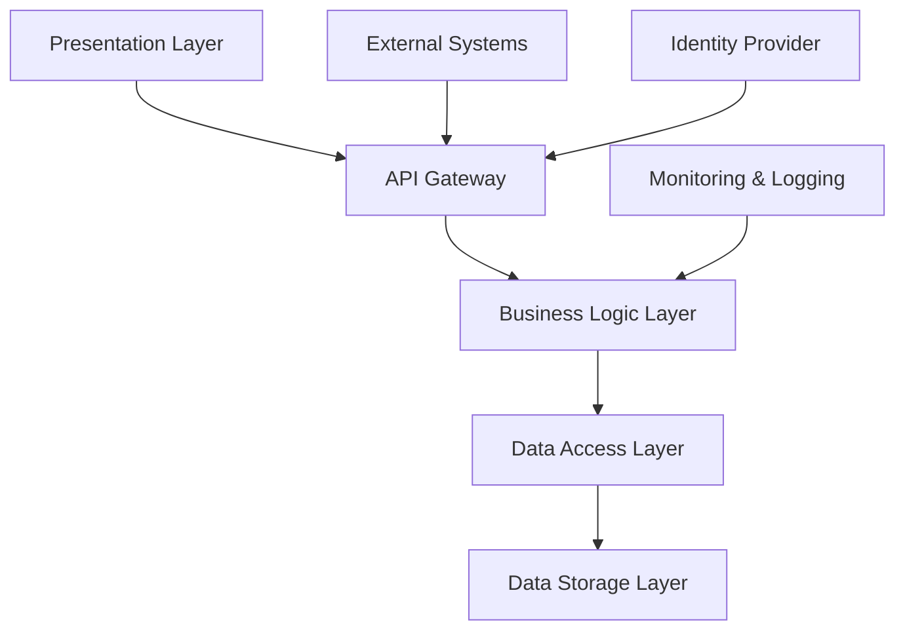
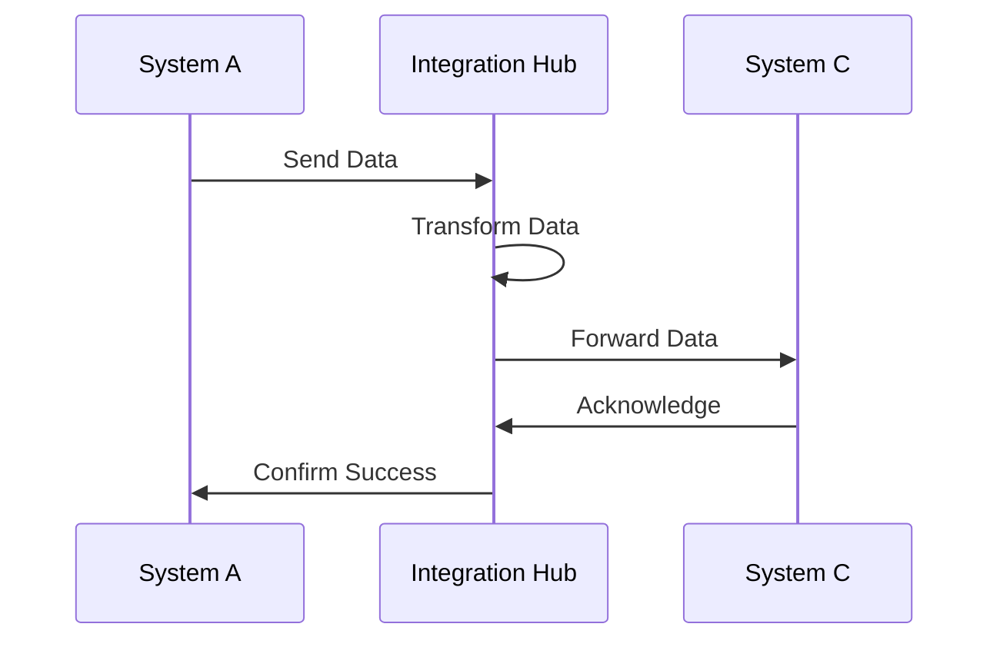
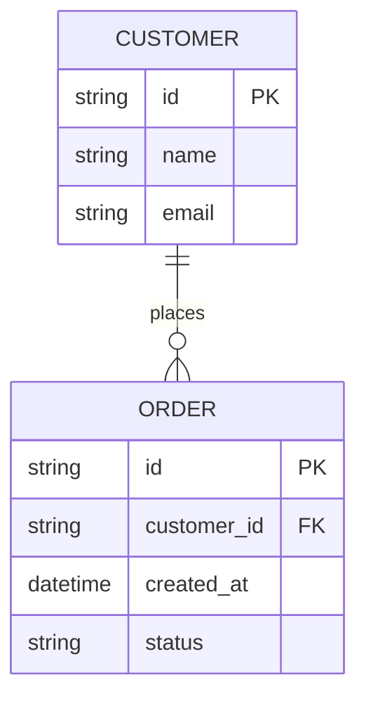
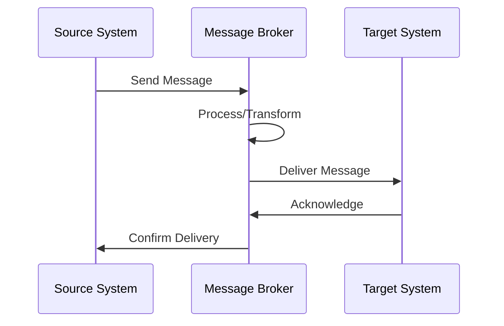
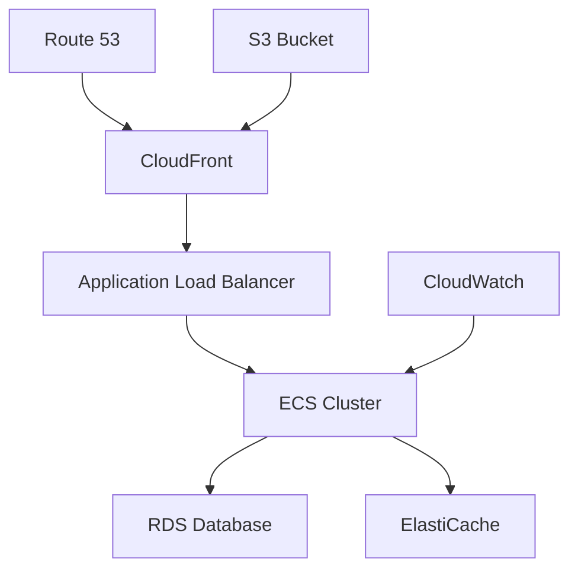

# Solution Architecture Documentation Templates

## Overview
Solution architecture templates optimized for both AI assistance and human workflow. These templates provide structured approaches to enterprise architecture, integration design, and solution blueprints while enabling AI to understand context and generate relevant architectural solutions.

## AI-Optimized Solution Architecture Prompts

### Primary Solution Architecture Prompt Template
```markdown
@copilot I need to create solution architecture for [SOLUTION_NAME].

Context:
- Business drivers: [BUSINESS_OBJECTIVES]
- Current state: [EXISTING_ARCHITECTURE]
- Constraints: [TECHNICAL_BUSINESS_CONSTRAINTS]
- Stakeholders: [KEY_STAKEHOLDERS]
- Timeline: [IMPLEMENTATION_TIMELINE]

Please generate [DELIVERABLE_TYPE] following enterprise architecture best practices.
```

### Specific Solution Architecture Prompt Templates

#### Solution Design
```markdown
@copilot Design enterprise solution architecture for [BUSINESS_CAPABILITY].

Context:
- Business requirements: [BUSINESS_NEEDS]
- Technology landscape: [CURRENT_TECH_STACK]
- Integration requirements: [SYSTEM_INTEGRATIONS]
- Compliance requirements: [REGULATORY_NEEDS]
- Budget constraints: [FINANCIAL_LIMITS]

Include: Architecture overview, component design, integration patterns, and deployment strategy.
```

#### Integration Architecture
```markdown
@copilot Create integration architecture for [INTEGRATION_SCENARIO].

Context:
- Source systems: [SYSTEM_LIST]
- Target systems: [DESTINATION_SYSTEMS]
- Data volume: [DATA_CHARACTERISTICS]
- Performance requirements: [SLA_REQUIREMENTS]
- Security requirements: [SECURITY_STANDARDS]

Include: Integration patterns, data flow diagrams, API specifications, and error handling.
```

#### Cloud Architecture
```markdown
@copilot Design cloud architecture for [APPLICATION_SYSTEM].

Context:
- Cloud platform: [AWS/AZURE/GCP]
- Migration strategy: [LIFT_SHIFT_REFACTOR]
- Scalability needs: [SCALING_REQUIREMENTS]
- Security requirements: [COMPLIANCE_STANDARDS]
- Cost optimization: [BUDGET_TARGETS]

Include: Cloud services mapping, migration plan, security design, and cost analysis.
```

## Template Documents

### 1. Solution Architecture Template
Comprehensive solution architecture documentation:

```markdown
# Solution Architecture: [Solution Name]

## Document Information
- **Version**: [Version number]
- **Architect**: [Architect name]
- **Date**: [Creation date]
- **Status**: [Draft/Review/Approved]
- **Stakeholders**: [Key stakeholders]

## Executive Summary
[High-level overview of the solution and its strategic value]

## Business Context

### Business Drivers
- **Strategic Objective 1**: [Description and alignment]
- **Strategic Objective 2**: [Description and alignment]
- **Strategic Objective 3**: [Description and alignment]

### Business Capabilities
- **Current State**: [Existing capabilities]
- **Future State**: [Target capabilities]
- **Gap Analysis**: [Capabilities to develop]

### Success Criteria
- **Business Outcome 1**: [Measurable target]
- **Business Outcome 2**: [Measurable target]
- **Business Outcome 3**: [Measurable target]

## Solution Overview

### Solution Vision
[Vision statement for the solution]

### Solution Scope
#### In Scope
- [Component 1]: [Description]
- [Component 2]: [Description]
- [Component 3]: [Description]

#### Out of Scope
- [Excluded item 1]: [Rationale]
- [Excluded item 2]: [Rationale]

### Solution Principles
- **Principle 1**: [Description and rationale]
- **Principle 2**: [Description and rationale]
- **Principle 3**: [Description and rationale]

## Architecture Overview

### High-Level Architecture


### Architecture Layers

#### Presentation Layer
**Purpose**: [User interface and experience]  
**Components**: [UI components and frameworks]  
**Technologies**: [Frontend technologies]  
**Responsibilities**: [Key responsibilities]

#### Business Logic Layer
**Purpose**: [Business rules and processes]  
**Components**: [Business services and APIs]  
**Technologies**: [Backend technologies]  
**Responsibilities**: [Key responsibilities]

#### Data Layer
**Purpose**: [Data management and persistence]  
**Components**: [Databases and storage systems]  
**Technologies**: [Data technologies]  
**Responsibilities**: [Key responsibilities]

#### Integration Layer
**Purpose**: [System integration and communication]  
**Components**: [Integration services and APIs]  
**Technologies**: [Integration technologies]  
**Responsibilities**: [Key responsibilities]

## Detailed Architecture

### Component Architecture

#### Component 1: [Component Name]
**Purpose**: [Component function]  
**Technology**: [Technology stack]  
**Interfaces**: [Input/output interfaces]  
**Dependencies**: [Dependencies on other components]

##### Component Specifications
- **Scalability**: [Scaling approach]
- **Availability**: [Availability requirements]
- **Performance**: [Performance requirements]
- **Security**: [Security considerations]

#### Component 2: [Component Name]
[Repeat structure...]

### Integration Architecture

#### Integration Patterns
- **Point-to-Point**: [Usage scenarios]
- **Message Queuing**: [Async communication]
- **API Gateway**: [Service mesh pattern]
- **Event-Driven**: [Event sourcing patterns]

#### Integration Flows


### Data Architecture

#### Data Strategy
- **Data Governance**: [Data management approach]
- **Data Quality**: [Quality assurance strategy]
- **Data Security**: [Data protection measures]
- **Data Lifecycle**: [Data retention policies]

#### Data Models
##### Conceptual Data Model


##### Logical Data Model
[Detailed entity relationships and attributes]

##### Physical Data Model
[Database-specific implementation details]

## Technology Architecture

### Technology Stack
| Layer | Technology | Justification | Alternatives |
|-------|------------|---------------|--------------|
| Frontend | [Technology] | [Reason] | [Alternatives] |
| Backend | [Technology] | [Reason] | [Alternatives] |
| Database | [Technology] | [Reason] | [Alternatives] |
| Integration | [Technology] | [Reason] | [Alternatives] |
| Infrastructure | [Technology] | [Reason] | [Alternatives] |

### Technology Standards
- **Programming Languages**: [Approved languages]
- **Frameworks**: [Approved frameworks]
- **Databases**: [Approved databases]
- **Tools**: [Development and deployment tools]

### Technology Roadmap
- **Phase 1**: [Initial technology choices]
- **Phase 2**: [Evolution and upgrades]
- **Phase 3**: [Future technology adoption]

## Security Architecture

### Security Principles
- **Zero Trust**: [Zero trust implementation]
- **Defense in Depth**: [Layered security approach]
- **Least Privilege**: [Access control strategy]
- **Data Protection**: [Data security measures]

### Security Components
- **Identity Management**: [Authentication and authorization]
- **Network Security**: [Firewall and network controls]
- **Data Security**: [Encryption and data protection]
- **Application Security**: [Secure coding practices]

### Security Controls
| Control Type | Description | Implementation |
|--------------|-------------|----------------|
| Preventive | [Control description] | [Implementation approach] |
| Detective | [Control description] | [Implementation approach] |
| Corrective | [Control description] | [Implementation approach] |

## Deployment Architecture

### Environment Strategy
- **Development**: [Development environment setup]
- **Testing**: [Test environment configuration]
- **Staging**: [Staging environment design]
- **Production**: [Production environment architecture]

### Deployment Patterns
- **Blue-Green Deployment**: [Implementation strategy]
- **Canary Deployment**: [Rollout approach]
- **Rolling Deployment**: [Update strategy]

### Infrastructure as Code
```yaml
# Example Terraform configuration
resource "aws_instance" "app_server" {
  ami           = var.ami_id
  instance_type = var.instance_type
  
  tags = {
    Name = "ApplicationServer"
    Environment = var.environment
  }
}
```

## Non-Functional Requirements

### Performance Requirements
- **Response Time**: [Maximum response time]
- **Throughput**: [Requests per second]
- **Concurrent Users**: [Maximum concurrent users]
- **Data Volume**: [Expected data volume]

### Scalability Requirements
- **Horizontal Scaling**: [Scaling approach]
- **Vertical Scaling**: [Resource scaling]
- **Auto-scaling**: [Automatic scaling triggers]
- **Load Distribution**: [Load balancing strategy]

### Availability Requirements
- **Uptime**: [Target availability percentage]
- **Disaster Recovery**: [Recovery time objectives]
- **Business Continuity**: [Continuity requirements]
- **Failover**: [Failover mechanisms]

### Security Requirements
- **Authentication**: [Identity verification]
- **Authorization**: [Access control]
- **Encryption**: [Data protection]
- **Compliance**: [Regulatory requirements]

## Implementation Strategy

### Implementation Phases
#### Phase 1: [Phase Name]
**Duration**: [Timeline]  
**Scope**: [Deliverables]  
**Dependencies**: [Prerequisites]  
**Success Criteria**: [Completion criteria]

#### Phase 2: [Phase Name]
[Repeat structure...]

### Migration Strategy
- **Migration Approach**: [Big bang vs phased]
- **Data Migration**: [Data transfer strategy]
- **Application Migration**: [App migration approach]
- **Rollback Plan**: [Rollback procedures]

### Change Management
- **Stakeholder Engagement**: [Communication plan]
- **Training**: [User training approach]
- **Support**: [Support model]
- **Documentation**: [Documentation strategy]

## Risk Management

### Architecture Risks
#### Risk 1: [Risk Description]
**Category**: [Technical/Business/Operational]  
**Probability**: [High/Medium/Low]  
**Impact**: [High/Medium/Low]  
**Mitigation**: [Risk mitigation strategy]  
**Contingency**: [Contingency plan]

#### Risk 2: [Risk Description]
[Repeat structure...]

### Dependencies and Assumptions
- **External Dependencies**: [Third-party dependencies]
- **Internal Dependencies**: [Internal team dependencies]
- **Assumptions**: [Key assumptions]

## Quality Assurance

### Architecture Review
- **Review Process**: [Architecture review process]
- **Review Criteria**: [Evaluation criteria]
- **Approval Gates**: [Approval requirements]

### Quality Metrics
- **Code Quality**: [Quality measurements]
- **Performance**: [Performance benchmarks]
- **Security**: [Security assessments]
- **Compliance**: [Compliance validation]

## Governance

### Architecture Governance
- **Governance Model**: [Governance structure]
- **Decision Rights**: [Decision-making authority]
- **Standards Compliance**: [Standards enforcement]
- **Exception Process**: [Exception handling]

### Change Control
- **Change Process**: [Change management process]
- **Impact Assessment**: [Change impact analysis]
- **Approval Process**: [Change approval workflow]
- **Communication**: [Change communication]

## Monitoring and Operations

### Monitoring Strategy
- **System Monitoring**: [Infrastructure monitoring]
- **Application Monitoring**: [Application performance]
- **Business Monitoring**: [Business metrics]
- **Security Monitoring**: [Security event monitoring]

### Operations Model
- **Support Model**: [Support structure]
- **Maintenance**: [Maintenance procedures]
- **Backup and Recovery**: [Backup strategy]
- **Capacity Planning**: [Capacity management]

## Cost Analysis

### Cost Components
- **Development**: [Development costs]
- **Infrastructure**: [Infrastructure costs]
- **Licensing**: [Software licensing]
- **Operations**: [Operational costs]

### Cost Optimization
- **Cost Drivers**: [Major cost factors]
- **Optimization Strategies**: [Cost reduction approaches]
- **ROI Analysis**: [Return on investment]

## Appendices

### Appendix A: Architecture Decision Records
- **ADR-001**: [Decision and rationale]
- **ADR-002**: [Decision and rationale]

### Appendix B: Technology Evaluation
- **Technology Comparison**: [Evaluation matrices]
- **Proof of Concepts**: [POC results]

### Appendix C: Standards and Guidelines
- **Coding Standards**: [Development standards]
- **Architecture Standards**: [Architecture guidelines]
- **Security Standards**: [Security requirements]

### Appendix D: Glossary
- **Term 1**: [Definition]
- **Term 2**: [Definition]
```

### 2. Integration Design Template
Specific integration architecture documentation:

```markdown
# Integration Architecture: [Integration Name]

## Integration Overview
- **Integration Type**: [API/Batch/Event-driven]
- **Source System**: [System name and details]
- **Target System**: [System name and details]
- **Data Volume**: [Expected data volume]
- **Frequency**: [Integration frequency]

## Integration Patterns

### Pattern Selection
- **Selected Pattern**: [Chosen integration pattern]
- **Justification**: [Why this pattern was chosen]
- **Alternative Patterns**: [Other patterns considered]

### Integration Flow


## Data Integration

### Data Mapping
| Source Field | Target Field | Transformation | Validation |
|-------------|-------------|----------------|------------|
| [source_field] | [target_field] | [transformation] | [validation_rule] |

### Data Transformation
- **Format Conversion**: [Data format changes]
- **Data Enrichment**: [Additional data sources]
- **Data Validation**: [Validation rules]
- **Error Handling**: [Error processing]

## API Specifications

### API Contract
```yaml
openapi: 3.0.0
info:
  title: [API Name]
  version: 1.0.0
paths:
  /api/v1/resource:
    post:
      summary: [Operation description]
      requestBody:
        content:
          application/json:
            schema:
              [Request schema]
      responses:
        '200':
          description: Success
          content:
            application/json:
              schema:
                [Response schema]
```

### Error Handling
- **Error Categories**: [Types of errors]
- **Error Codes**: [Standard error codes]
- **Retry Logic**: [Retry mechanisms]
- **Dead Letter Queue**: [Failed message handling]

## Security Design

### Authentication
- **Method**: [Authentication approach]
- **Credentials**: [Credential management]
- **Token Management**: [Token lifecycle]

### Authorization
- **Access Control**: [Permission model]
- **Role-based Access**: [Role definitions]
- **Audit Logging**: [Security audit trail]

## Performance and Scalability

### Performance Requirements
- **Latency**: [Response time requirements]
- **Throughput**: [Messages per second]
- **Availability**: [Uptime requirements]

### Scalability Strategy
- **Horizontal Scaling**: [Scaling approach]
- **Load Balancing**: [Load distribution]
- **Caching**: [Caching strategy]

## Monitoring and Observability

### Monitoring Strategy
- **Integration Metrics**: [Key metrics to track]
- **Performance Monitoring**: [Performance indicators]
- **Error Monitoring**: [Error tracking]

### Alerting
- **Alert Conditions**: [When to alert]
- **Escalation**: [Alert escalation process]
- **Dashboard**: [Monitoring dashboard]
```

### 3. Deployment Architecture Template
Infrastructure and deployment design:

```markdown
# Deployment Architecture: [System Name]

## Deployment Overview
- **Deployment Model**: [Cloud/On-premise/Hybrid]
- **Deployment Strategy**: [Strategy description]
- **Target Environment**: [Environment details]
- **Scaling Approach**: [Scaling strategy]

## Infrastructure Architecture

### Cloud Architecture (AWS Example)


### Infrastructure Components
| Component | Service | Purpose | Configuration |
|-----------|---------|---------|---------------|
| Load Balancer | [Service name] | [Purpose] | [Configuration] |
| Compute | [Service name] | [Purpose] | [Configuration] |
| Database | [Service name] | [Purpose] | [Configuration] |
| Storage | [Service name] | [Purpose] | [Configuration] |

### Network Architecture
- **VPC Design**: [Virtual network configuration]
- **Subnets**: [Subnet configuration]
- **Security Groups**: [Security group rules]
- **Network ACLs**: [Network access control]

## Environment Strategy

### Environment Definitions
#### Development Environment
- **Purpose**: [Development activities]
- **Configuration**: [Environment setup]
- **Data**: [Test data strategy]
- **Access**: [Developer access]

#### Testing Environment
- **Purpose**: [Testing activities]
- **Configuration**: [Environment setup]
- **Data**: [Test data management]
- **Access**: [Tester access]

#### Production Environment
- **Purpose**: [Live system]
- **Configuration**: [Production setup]
- **Data**: [Production data]
- **Access**: [Production access]

### Environment Promotion
- **Promotion Process**: [Code promotion workflow]
- **Approval Gates**: [Approval requirements]
- **Rollback Strategy**: [Rollback procedures]

## Deployment Pipeline

### CI/CD Pipeline
```yaml
# Example GitHub Actions workflow
name: Deploy to Production
on:
  push:
    branches: [main]
jobs:
  deploy:
    runs-on: ubuntu-latest
    steps:
      - uses: actions/checkout@v2
      - name: Setup Node.js
        uses: actions/setup-node@v2
        with:
          node-version: '14'
      - name: Install dependencies
        run: npm install
      - name: Run tests
        run: npm test
      - name: Deploy to production
        run: npm run deploy
```

### Deployment Strategies
- **Blue-Green**: [Implementation details]
- **Canary**: [Rollout approach]
- **Rolling**: [Update strategy]

## Security Configuration

### Security Controls
- **Network Security**: [Firewall rules]
- **Access Control**: [Identity management]
- **Data Protection**: [Encryption configuration]
- **Monitoring**: [Security monitoring]

### Compliance
- **Regulatory Requirements**: [Compliance standards]
- **Audit Requirements**: [Audit logging]
- **Data Privacy**: [Privacy controls]

## Monitoring and Alerting

### Monitoring Stack
- **Infrastructure Monitoring**: [Monitoring tools]
- **Application Monitoring**: [APM tools]
- **Log Management**: [Logging solution]
- **Alerting**: [Alert management]

### Key Metrics
- **System Metrics**: [CPU, memory, disk]
- **Application Metrics**: [Response time, throughput]
- **Business Metrics**: [Business KPIs]

## Disaster Recovery

### Backup Strategy
- **Backup Types**: [Full/incremental backups]
- **Backup Schedule**: [Backup frequency]
- **Backup Storage**: [Backup location]
- **Restoration Process**: [Recovery procedures]

### Disaster Recovery Plan
- **RTO**: [Recovery time objective]
- **RPO**: [Recovery point objective]
- **Failover Process**: [Failover procedures]
- **Testing**: [DR testing schedule]
```

## Process Workflow

### 1. Architecture Analysis
```markdown
## Architecture Analysis Checklist
- [ ] Business requirements analyzed
- [ ] Current state assessment completed
- [ ] Technology landscape reviewed
- [ ] Integration requirements identified
- [ ] Non-functional requirements captured
- [ ] Constraints and assumptions documented
```

### 2. Solution Design
```markdown
## Solution Design Checklist
- [ ] Solution architecture defined
- [ ] Integration architecture designed
- [ ] Deployment architecture specified
- [ ] Security architecture planned
- [ ] Performance architecture designed
- [ ] Monitoring strategy defined
```

### 3. Architecture Review
```markdown
## Architecture Review Checklist
- [ ] Peer review completed
- [ ] Security review conducted
- [ ] Performance review done
- [ ] Scalability assessment finished
- [ ] Compliance validation completed
- [ ] Stakeholder approval received
```

## Integration with Implementation

### Architecture Governance
```markdown
## Architecture Governance Checklist
- [ ] Architecture decisions documented
- [ ] Standards compliance verified
- [ ] Exception processes defined
- [ ] Change control established
- [ ] Quality gates implemented
- [ ] Monitoring established
```

### Collaboration with AI
```markdown
## AI Collaboration Best Practices
- Provide complete business context
- Include current state architecture
- Specify constraints and requirements
- Reference architectural patterns
- Request implementation guidance
- Validate architectural decisions
```

## Tools and Resources

### Architecture Tools
- **Modeling**: [Enterprise architecture tools]
- **Diagramming**: [Architecture diagram tools]
- **Documentation**: [Documentation platforms]

### Cloud Tools
- **AWS**: [AWS architecture tools]
- **Azure**: [Azure architecture tools]
- **GCP**: [GCP architecture tools]

### Governance Tools
- **Decision Tracking**: [ADR tools]
- **Standards Management**: [Standards repositories]
- **Compliance**: [Compliance tools]

---

**Note**: These templates are designed to work with GitHub Copilot and should be customized based on your specific enterprise architecture standards and governance requirements.
