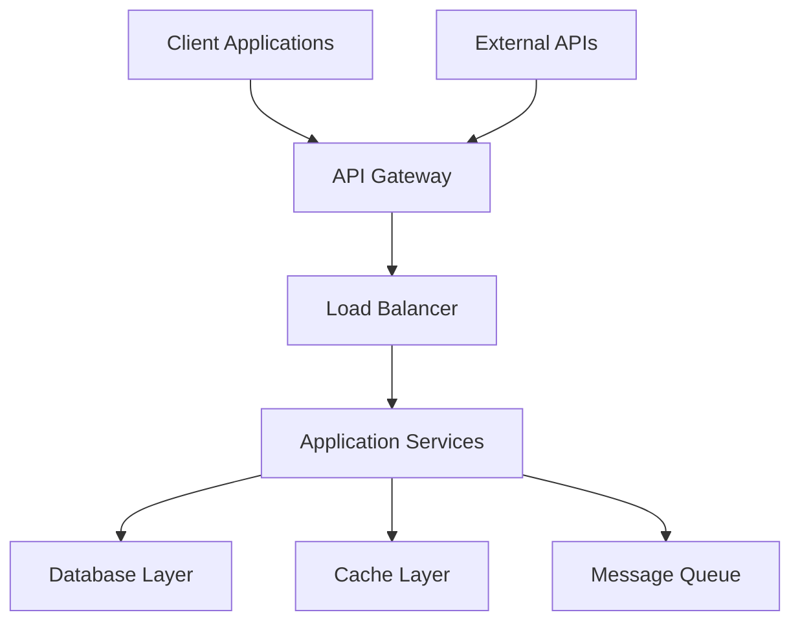
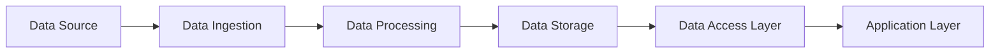
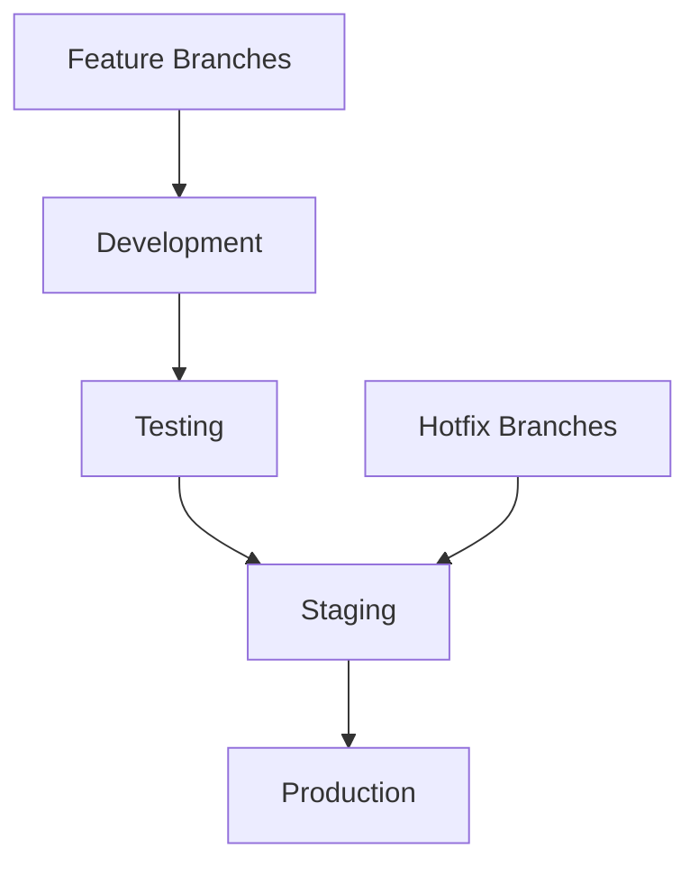
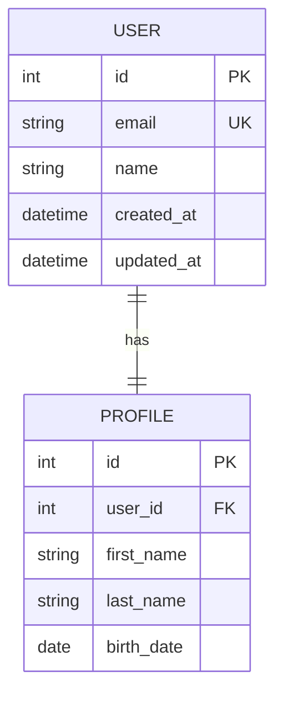

# Technical Design Documentation Templates

## Overview
Technical design templates optimized for both AI assistance and human workflow. These templates provide structured approaches to system architecture, API design, and technical specifications while enabling AI to understand context and generate relevant technical solutions.

## AI-Optimized Technical Design Prompts

### Primary Technical Design Prompt Template
```markdown
@copilot I need to create technical documentation for [SYSTEM/COMPONENT].

Context:
- Functional requirements: [BUSINESS_REQUIREMENTS]
- Technology stack: [CURRENT_TECH_STACK]
- Performance requirements: [PERFORMANCE_SPECS]
- Security requirements: [SECURITY_CONSTRAINTS]
- Integration needs: [EXTERNAL_SYSTEMS]

Please generate [DELIVERABLE_TYPE] following technical design best practices.
```

### Specific Technical Design Prompt Templates

#### System Architecture Design
```markdown
@copilot Design system architecture for [SYSTEM_NAME].

Context:
- Scale requirements: [USER_LOAD_DATA_VOLUME]
- Technology preferences: [TECH_STACK_PREFERENCES]
- Security requirements: [SECURITY_STANDARDS]
- Integration points: [EXTERNAL_SYSTEMS]
- Deployment constraints: [INFRASTRUCTURE_LIMITS]

Include: Architecture diagrams, component descriptions, data flow, and deployment strategy.
```

#### API Design Specification
```markdown
@copilot Create API specification for [API_NAME].

Context:
- Use cases: [API_USE_CASES]
- Data models: [DATA_STRUCTURES]
- Authentication: [AUTH_REQUIREMENTS]
- Performance: [RESPONSE_TIME_THROUGHPUT]
- Versioning strategy: [VERSIONING_APPROACH]

Include: OpenAPI specification, endpoint definitions, authentication flows, and error handling.
```

#### Database Design
```markdown
@copilot Design database schema for [APPLICATION_NAME].

Context:
- Data requirements: [DATA_ENTITIES_RELATIONSHIPS]
- Query patterns: [TYPICAL_QUERIES]
- Performance requirements: [QUERY_PERFORMANCE]
- Data volume: [EXPECTED_DATA_SIZE]
- Compliance: [DATA_PRIVACY_REGULATIONS]

Include: ER diagrams, table definitions, indexing strategy, and data migration plan.
```

## Template Documents

### 1. System Design Template
Comprehensive system architecture documentation:

```markdown
# System Design: [System Name]

## Document Information
- **Version**: [Version number]
- **Author**: [Author name]
- **Date**: [Creation date]
- **Status**: [Draft/Review/Approved]
- **Reviewers**: [List of reviewers]

## Executive Summary
[Brief overview of the system and its technical approach]

## System Context

### Problem Statement
[Technical problem being solved]

### Technical Objectives
- [Objective 1]: [Description and success metrics]
- [Objective 2]: [Description and success metrics]
- [Objective 3]: [Description and success metrics]

### Constraints
- **Technical**: [Technology limitations]
- **Business**: [Budget and timeline constraints]
- **Regulatory**: [Compliance requirements]

## Architecture Overview

### High-Level Architecture


### Architecture Principles
- **Scalability**: [Horizontal scaling approach]
- **Reliability**: [High availability design]
- **Security**: [Defense in depth]
- **Performance**: [Caching and optimization]
- **Maintainability**: [Modular design]

## Detailed Design

### Component Architecture

#### Component 1: [Component Name]
**Purpose**: [What this component does]  
**Technology**: [Technology stack]  
**Responsibilities**: [Key responsibilities]  
**Interfaces**: [APIs and contracts]  
**Dependencies**: [Dependencies on other components]

##### Technical Specifications
- **Language/Framework**: [Technology details]
- **Database**: [Data storage details]
- **Caching**: [Caching strategy]
- **Monitoring**: [Observability approach]

#### Component 2: [Component Name]
[Repeat structure...]

### Data Architecture

#### Data Flow


#### Data Models
##### Entity 1: [Entity Name]
```json
{
  "id": "string",
  "property1": "string",
  "property2": "number",
  "property3": {
    "subProperty1": "string",
    "subProperty2": "boolean"
  },
  "createdAt": "datetime",
  "updatedAt": "datetime"
}
```

##### Entity 2: [Entity Name]
[Repeat structure...]

### API Design

#### API Architecture
- **Style**: [REST/GraphQL/gRPC]
- **Authentication**: [JWT/OAuth/API Key]
- **Versioning**: [URL/Header/Content-Type]
- **Rate Limiting**: [Strategy and limits]

#### Key Endpoints
##### Endpoint 1: [Endpoint Name]
```yaml
/api/v1/[resource]:
  get:
    summary: [Brief description]
    parameters:
      - name: [parameter]
        in: [query/path/header]
        required: [true/false]
        schema:
          type: [type]
    responses:
      200:
        description: [Success response]
        content:
          application/json:
            schema:
              [Response schema]
      400:
        description: [Error description]
```

##### Endpoint 2: [Endpoint Name]
[Repeat structure...]

## Technical Specifications

### Performance Requirements
- **Response Time**: [Target latency]
- **Throughput**: [Requests per second]
- **Concurrent Users**: [Maximum concurrent load]
- **Data Volume**: [Expected data size]

### Scalability Design
- **Horizontal Scaling**: [Scaling strategy]
- **Auto-scaling**: [Scaling triggers]
- **Load Balancing**: [Distribution strategy]
- **Database Scaling**: [Sharding/replication]

### Security Design
- **Authentication**: [Implementation approach]
- **Authorization**: [RBAC/ABAC design]
- **Data Protection**: [Encryption at rest/transit]
- **Network Security**: [Firewall/VPN requirements]

### Monitoring and Observability
- **Logging**: [Structured logging approach]
- **Metrics**: [Key performance indicators]
- **Tracing**: [Distributed tracing strategy]
- **Alerting**: [Alert conditions and escalation]

## Implementation Strategy

### Technology Stack
| Layer | Technology | Justification |
|-------|------------|---------------|
| Frontend | [Technology] | [Reason for choice] |
| Backend | [Technology] | [Reason for choice] |
| Database | [Technology] | [Reason for choice] |
| Cache | [Technology] | [Reason for choice] |
| Message Queue | [Technology] | [Reason for choice] |
| Infrastructure | [Technology] | [Reason for choice] |

### Development Approach
- **Methodology**: [Agile/Scrum/Kanban]
- **Code Standards**: [Coding conventions]
- **Testing Strategy**: [Unit/Integration/E2E]
- **CI/CD Pipeline**: [Deployment approach]

### Deployment Architecture


## Risk Assessment

### Technical Risks
#### Risk 1: [Risk Description]
**Probability**: [High/Medium/Low]  
**Impact**: [High/Medium/Low]  
**Mitigation**: [Mitigation strategy]  
**Contingency**: [Backup plan]

#### Risk 2: [Risk Description]
[Repeat structure...]

### Dependencies and Assumptions
- **External Dependencies**: [Third-party services]
- **Internal Dependencies**: [Other team deliverables]
- **Assumptions**: [Technical assumptions]

## Quality Assurance

### Testing Strategy
- **Unit Testing**: [Coverage requirements]
- **Integration Testing**: [API testing approach]
- **Performance Testing**: [Load testing plan]
- **Security Testing**: [Security validation]

### Code Quality
- **Code Reviews**: [Review process]
- **Static Analysis**: [Tools and standards]
- **Documentation**: [Documentation requirements]
- **Refactoring**: [Technical debt management]

## Operational Considerations

### Monitoring and Alerting
- **System Metrics**: [Key metrics to monitor]
- **Business Metrics**: [KPIs to track]
- **Alert Conditions**: [When to alert]
- **Escalation Procedures**: [Who to notify]

### Backup and Recovery
- **Backup Strategy**: [Backup frequency and retention]
- **Recovery Procedures**: [Recovery time objectives]
- **Disaster Recovery**: [DR plan]

### Capacity Planning
- **Growth Projections**: [Expected growth rates]
- **Resource Planning**: [Infrastructure needs]
- **Cost Projections**: [Operational costs]

## Appendices

### Appendix A: Architecture Decision Records (ADRs)
- **ADR-001**: [Decision title and rationale]
- **ADR-002**: [Decision title and rationale]

### Appendix B: Technical Specifications
- **Database Schema**: [Detailed schema]
- **API Specifications**: [Complete API docs]
- **Configuration**: [System configuration]

### Appendix C: Glossary
- **Term 1**: [Definition]
- **Term 2**: [Definition]
```

### 2. API Design Template
Structured API documentation:

```markdown
# API Design: [API Name]

## Overview
- **Version**: [API version]
- **Base URL**: [API base URL]
- **Authentication**: [Auth method]
- **Rate Limiting**: [Rate limits]

## Design Principles
- **RESTful Design**: [REST compliance]
- **Consistency**: [Naming conventions]
- **Versioning**: [Versioning strategy]
- **Error Handling**: [Error response format]

## Authentication
### Authentication Method
[Detailed authentication flow]

### Authorization
[Role-based access control details]

## API Endpoints

### Resource: [Resource Name]
#### GET /api/v1/[resource]
**Description**: [Endpoint description]

**Parameters**:
- `param1` (query, optional): [Description]
- `param2` (query, required): [Description]

**Response**:
```json
{
  "data": [
    {
      "id": "string",
      "property1": "string",
      "property2": "number"
    }
  ],
  "meta": {
    "total": "number",
    "page": "number",
    "limit": "number"
  }
}
```

**Error Responses**:
- `400`: Bad Request
- `401`: Unauthorized
- `403`: Forbidden
- `404`: Not Found
- `500`: Internal Server Error

#### POST /api/v1/[resource]
[Repeat structure...]

## Data Models
### Model: [Model Name]
```json
{
  "id": "string",
  "property1": "string",
  "property2": "number",
  "property3": {
    "subProperty1": "string",
    "subProperty2": "boolean"
  },
  "timestamps": {
    "createdAt": "datetime",
    "updatedAt": "datetime"
  }
}
```

## Error Handling
### Error Response Format
```json
{
  "error": {
    "code": "string",
    "message": "string",
    "details": [
      {
        "field": "string",
        "message": "string"
      }
    ]
  }
}
```

### Error Codes
| Code | Description | HTTP Status |
|------|-------------|-------------|
| `INVALID_REQUEST` | Request validation failed | 400 |
| `UNAUTHORIZED` | Authentication required | 401 |
| `FORBIDDEN` | Access denied | 403 |
| `NOT_FOUND` | Resource not found | 404 |
| `INTERNAL_ERROR` | Server error | 500 |

## Rate Limiting
- **Limit**: [Requests per time period]
- **Headers**: [Rate limit headers]
- **Exceeded Response**: [Response when limit exceeded]

## Caching
- **Cache-Control**: [Caching headers]
- **ETags**: [ETag implementation]
- **Expiration**: [Cache expiration strategy]

## Pagination
### Cursor-based Pagination
```json
{
  "data": [...],
  "pagination": {
    "cursor": "string",
    "hasMore": "boolean",
    "limit": "number"
  }
}
```

## Webhooks
### Webhook Events
- **Event Type 1**: [Description]
- **Event Type 2**: [Description]

### Webhook Payload
```json
{
  "event": "string",
  "data": {...},
  "timestamp": "datetime"
}
```

## Testing
### Test Scenarios
- **Happy Path**: [Successful request/response]
- **Error Cases**: [Error conditions]
- **Edge Cases**: [Boundary conditions]

### Test Data
[Sample test data and fixtures]
```

### 3. Database Design Template
Database schema documentation:

```markdown
# Database Design: [Database Name]

## Overview
- **Database Type**: [SQL/NoSQL/Graph]
- **Technology**: [PostgreSQL/MongoDB/etc.]
- **Version**: [Database version]
- **Schema**: [Schema name]

## Design Principles
- **Normalization**: [Normal form compliance]
- **Performance**: [Optimization approach]
- **Scalability**: [Scaling strategy]
- **Data Integrity**: [Constraint strategy]

## Entity Relationship Diagram


## Table Definitions

### Table: users
**Purpose**: [Table description]

| Column | Type | Constraints | Description |
|--------|------|-------------|-------------|
| id | SERIAL | PRIMARY KEY | Unique identifier |
| email | VARCHAR(255) | UNIQUE, NOT NULL | User email address |
| name | VARCHAR(255) | NOT NULL | User display name |
| created_at | TIMESTAMP | DEFAULT NOW() | Creation timestamp |
| updated_at | TIMESTAMP | DEFAULT NOW() | Last update timestamp |

**Indexes**:
- `idx_users_email`: ON email (unique)
- `idx_users_created_at`: ON created_at

### Table: [Table Name]
[Repeat structure...]

## Relationships
- **users** → **profiles**: One-to-One
- **users** → **orders**: One-to-Many
- **orders** → **products**: Many-to-Many

## Queries and Performance

### Common Queries
#### Query 1: [Query Description]
```sql
SELECT u.id, u.email, p.first_name, p.last_name
FROM users u
JOIN profiles p ON u.id = p.user_id
WHERE u.email = $1;
```

**Performance**: [Expected execution time]  
**Indexes Used**: [Relevant indexes]

#### Query 2: [Query Description]
[Repeat structure...]

### Optimization Strategy
- **Indexing**: [Index strategy]
- **Partitioning**: [Partition strategy]
- **Caching**: [Query caching approach]
- **Connection Pooling**: [Connection management]

## Data Migration

### Migration Strategy
- **Versioning**: [Schema versioning approach]
- **Rollback**: [Rollback strategy]
- **Zero-downtime**: [Migration approach]

### Migration Scripts
```sql
-- Migration: 001_create_users_table.sql
CREATE TABLE users (
    id SERIAL PRIMARY KEY,
    email VARCHAR(255) UNIQUE NOT NULL,
    name VARCHAR(255) NOT NULL,
    created_at TIMESTAMP DEFAULT NOW(),
    updated_at TIMESTAMP DEFAULT NOW()
);

CREATE INDEX idx_users_email ON users(email);
```

## Security Considerations
- **Access Control**: [User permissions]
- **Data Encryption**: [Encryption at rest]
- **Audit Logging**: [Change tracking]
- **Backup Security**: [Backup encryption]

## Backup and Recovery
- **Backup Frequency**: [Backup schedule]
- **Retention Policy**: [Backup retention]
- **Recovery Procedures**: [Recovery steps]
- **Testing**: [Backup testing schedule]

## Monitoring
- **Performance Metrics**: [Key metrics]
- **Query Performance**: [Slow query monitoring]
- **Storage Monitoring**: [Disk usage tracking]
- **Connection Monitoring**: [Connection pool metrics]
```

## Process Workflow

### 1. Technical Analysis
```markdown
## Technical Analysis Checklist
- [ ] Functional requirements analyzed
- [ ] Technical constraints identified
- [ ] Performance requirements defined
- [ ] Security requirements specified
- [ ] Integration requirements captured
- [ ] Technology stack selected
```

### 2. Architecture Design
```markdown
## Architecture Design Checklist
- [ ] High-level architecture defined
- [ ] Component architecture detailed
- [ ] Data architecture designed
- [ ] API specifications created
- [ ] Security architecture planned
- [ ] Deployment architecture specified
```

### 3. Technical Review
```markdown
## Technical Review Checklist
- [ ] Architecture review completed
- [ ] Security review conducted
- [ ] Performance review done
- [ ] Scalability assessment finished
- [ ] Code review standards defined
- [ ] Technical approval received
```

## Integration with Development

### Handoff to Implementation
```markdown
## Implementation Handoff Checklist
- [ ] Technical specifications documented
- [ ] Architecture diagrams created
- [ ] API contracts defined
- [ ] Database schemas specified
- [ ] Security requirements detailed
- [ ] Performance targets set
```

### Collaboration with AI
```markdown
## AI Collaboration Best Practices
- Provide complete technical context
- Include performance requirements
- Specify technology constraints
- Reference architectural patterns
- Request code examples
- Validate technical solutions
```

## Tools and Resources

### Design Tools
- **Architecture**: [Lucidchart, Draw.io]
- **API Design**: [Swagger/OpenAPI, Postman]
- **Database**: [dbdiagram.io, ERD tools]

### Documentation Tools
- **Markdown**: [Documentation standards]
- **Mermaid**: [Diagram as code]
- **PlantUML**: [UML diagrams]

### Development Tools
- **IDE**: [Development environments]
- **Version Control**: [Git workflows]
- **CI/CD**: [Pipeline tools]

---

**Note**: These templates are designed to work with GitHub Copilot and should be customized based on your specific technology stack and project requirements.
