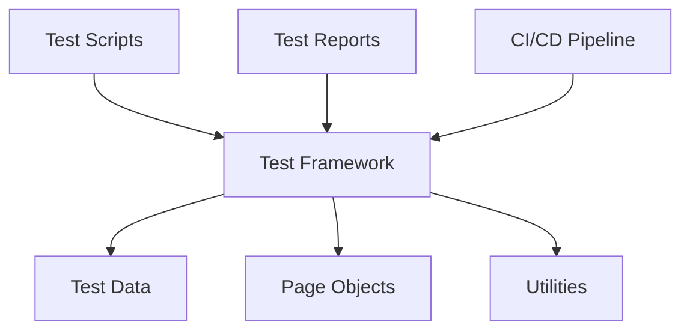

# Testing Documentation Templates

## Overview
Testing templates optimized for both AI assistance and human workflow. These templates provide structured approaches to test strategy, test planning, and test execution while enabling AI to understand context and generate relevant test cases, automation scripts, and testing documentation.

## AI-Optimized Testing Prompts

### Primary Testing Prompt Template
```markdown
@copilot I need to create testing documentation for [SYSTEM/FEATURE].

Context:
- System under test: [SYSTEM_DESCRIPTION]
- Test scope: [TESTING_SCOPE]
- Quality requirements: [QUALITY_CRITERIA]
- Technology stack: [TESTING_TOOLS]
- Test environment: [ENVIRONMENT_DETAILS]

Please generate [DELIVERABLE_TYPE] following testing best practices.
```

### Specific Testing Prompt Templates

#### Test Strategy Creation
```markdown
@copilot Create a comprehensive test strategy for [PROJECT/SYSTEM].

Context:
- System architecture: [ARCHITECTURE_OVERVIEW]
- Quality requirements: [QUALITY_ATTRIBUTES]
- Risk areas: [HIGH_RISK_COMPONENTS]
- Testing constraints: [TIME_BUDGET_RESOURCES]
- Compliance requirements: [REGULATORY_STANDARDS]

Include: Test levels, test types, test approach, and test automation strategy.
```

#### Test Case Generation
```markdown
@copilot Generate test cases for [FEATURE/FUNCTION].

Context:
- Requirements: [FUNCTIONAL_REQUIREMENTS]
- User stories: [USER_STORIES]
- Business rules: [BUSINESS_RULES]
- Edge cases: [KNOWN_EDGE_CASES]
- Error conditions: [ERROR_SCENARIOS]

Include: Positive tests, negative tests, boundary tests, and exploratory test ideas.
```

#### Test Automation Scripts
```markdown
@copilot Create automated test scripts for [FEATURE/API].

Context:
- Test framework: [TESTING_FRAMEWORK]
- Application type: [WEB_API_MOBILE]
- Test data: [TEST_DATA_REQUIREMENTS]
- Environment: [TEST_ENVIRONMENT]
- Integration points: [EXTERNAL_DEPENDENCIES]

Include: Test setup, test execution, assertions, and cleanup procedures.
```

## Template Documents

### 1. Test Strategy Template
Comprehensive test strategy documentation:

```markdown
# Test Strategy: [Project/System Name]

## Document Information
- **Version**: [Version number]
- **Author**: [Author name]
- **Date**: [Creation date]
- **Status**: [Draft/Review/Approved]
- **Reviewers**: [List of reviewers]

## Executive Summary
[Brief overview of the testing approach and key quality objectives]

## Project Context

### System Overview
[Description of the system being tested]

### Quality Objectives
- **Reliability**: [Target reliability metrics]
- **Performance**: [Target performance metrics]
- **Security**: [Security quality requirements]
- **Usability**: [User experience requirements]
- **Maintainability**: [Code quality requirements]

### Scope of Testing
#### In Scope
- [Component 1]: [Testing approach]
- [Component 2]: [Testing approach]
- [Component 3]: [Testing approach]

#### Out of Scope
- [Excluded component 1]: [Rationale]
- [Excluded component 2]: [Rationale]

## Test Approach

### Test Levels
#### Unit Testing
**Objective**: [Testing individual components]  
**Responsibility**: [Development team]  
**Coverage Target**: [90%+ code coverage]  
**Tools**: [Testing frameworks]  
**Automation**: [Automated in CI/CD]

#### Integration Testing
**Objective**: [Testing component interactions]  
**Responsibility**: [Development/QA team]  
**Coverage Target**: [All integration points]  
**Tools**: [Integration testing tools]  
**Automation**: [Automated integration tests]

#### System Testing
**Objective**: [End-to-end system validation]  
**Responsibility**: [QA team]  
**Coverage Target**: [All major user journeys]  
**Tools**: [System testing tools]  
**Automation**: [Automated E2E tests]

#### Acceptance Testing
**Objective**: [Business requirement validation]  
**Responsibility**: [Business stakeholders]  
**Coverage Target**: [All acceptance criteria]  
**Tools**: [UAT tools]  
**Automation**: [BDD automation]

### Test Types

#### Functional Testing
- **Feature Testing**: [Testing feature functionality]
- **Regression Testing**: [Ensuring existing functionality]
- **User Acceptance Testing**: [Business validation]
- **API Testing**: [API functionality and contracts]

#### Non-Functional Testing
- **Performance Testing**: [Load, stress, volume testing]
- **Security Testing**: [Security vulnerability testing]
- **Usability Testing**: [User experience testing]
- **Compatibility Testing**: [Cross-platform testing]

#### Specialized Testing
- **Accessibility Testing**: [A11y compliance testing]
- **Localization Testing**: [Multi-language support]
- **Mobile Testing**: [Mobile-specific testing]
- **Browser Testing**: [Cross-browser compatibility]

## Test Environment Strategy

### Environment Types
#### Development Environment
**Purpose**: [Developer testing]  
**Configuration**: [Environment setup]  
**Data**: [Test data strategy]  
**Access**: [Developer access]

#### Test Environment
**Purpose**: [QA testing]  
**Configuration**: [Test environment setup]  
**Data**: [Test data management]  
**Access**: [QA team access]

#### Staging Environment
**Purpose**: [Pre-production testing]  
**Configuration**: [Production-like setup]  
**Data**: [Production-like data]  
**Access**: [Limited access]

### Test Data Management
- **Test Data Strategy**: [Data provisioning approach]
- **Data Privacy**: [PII protection measures]
- **Data Refresh**: [Data update procedures]
- **Data Cleanup**: [Data cleanup strategy]

## Test Automation Strategy

### Automation Framework
- **Framework Type**: [Keyword-driven/Data-driven/Hybrid]
- **Programming Language**: [Language choice]
- **Test Tools**: [Automation tools]
- **CI/CD Integration**: [Pipeline integration]

### Automation Scope
- **Unit Tests**: [100% automation target]
- **Integration Tests**: [80% automation target]
- **API Tests**: [90% automation target]
- **UI Tests**: [60% automation target]

### Automation Architecture


## Test Execution Strategy

### Test Execution Process
1. **Test Planning**: [Define test scope and approach]
2. **Test Design**: [Create test cases and scripts]
3. **Test Execution**: [Execute tests and record results]
4. **Defect Management**: [Track and resolve defects]
5. **Test Reporting**: [Generate test reports]

### Test Scheduling
- **Sprint Testing**: [Within-sprint testing]
- **Regression Testing**: [Post-deployment testing]
- **Release Testing**: [Pre-release validation]
- **Production Testing**: [Post-deployment verification]

## Defect Management

### Defect Lifecycle
1. **Discovery**: [Defect identification]
2. **Logging**: [Defect documentation]
3. **Triage**: [Defect prioritization]
4. **Assignment**: [Developer assignment]
5. **Resolution**: [Defect fixing]
6. **Verification**: [Fix validation]
7. **Closure**: [Defect closure]

### Defect Severity Levels
- **Critical**: [System unusable]
- **High**: [Major functionality affected]
- **Medium**: [Minor functionality affected]
- **Low**: [Cosmetic issues]

### Defect Priority Levels
- **P1**: [Fix immediately]
- **P2**: [Fix in current sprint]
- **P3**: [Fix in next sprint]
- **P4**: [Fix when time permits]

## Quality Metrics

### Test Metrics
- **Test Coverage**: [Code and requirement coverage]
- **Test Execution**: [Pass/fail rates]
- **Defect Metrics**: [Defect density and trends]
- **Automation Metrics**: [Automation coverage and success]

### Quality Gates
- **Code Coverage**: [Minimum 80%]
- **Test Pass Rate**: [Minimum 95%]
- **Defect Density**: [Maximum X defects per KLOC]
- **Performance**: [Response time < X seconds]

## Risk Assessment

### Testing Risks
#### Risk 1: [Risk Description]
**Probability**: [High/Medium/Low]  
**Impact**: [High/Medium/Low]  
**Mitigation**: [Risk mitigation strategy]

#### Risk 2: [Risk Description]
[Repeat structure...]

### Quality Risks
- **Functional Risks**: [Feature not working correctly]
- **Performance Risks**: [System performance issues]
- **Security Risks**: [Security vulnerabilities]
- **Usability Risks**: [Poor user experience]

## Resource Planning

### Team Structure
- **Test Manager**: [Role and responsibilities]
- **Test Lead**: [Role and responsibilities]
- **Test Engineers**: [Role and responsibilities]
- **Automation Engineers**: [Role and responsibilities]

### Skill Requirements
- **Manual Testing**: [Required skills]
- **Automation Testing**: [Required skills]
- **Performance Testing**: [Required skills]
- **Security Testing**: [Required skills]

### Training Needs
- **Tool Training**: [Training requirements]
- **Domain Knowledge**: [Business domain training]
- **Technical Skills**: [Technical skill development]

## Tools and Infrastructure

### Testing Tools
| Tool Category | Tool Name | Purpose | License |
|---------------|-----------|---------|---------|
| Test Management | [Tool name] | [Purpose] | [License type] |
| Test Automation | [Tool name] | [Purpose] | [License type] |
| Performance Testing | [Tool name] | [Purpose] | [License type] |
| Security Testing | [Tool name] | [Purpose] | [License type] |

### Infrastructure Requirements
- **Test Servers**: [Server specifications]
- **Test Databases**: [Database requirements]
- **Network**: [Network configurations]
- **Security**: [Security requirements]

## Compliance and Standards

### Testing Standards
- **IEEE 829**: [Test documentation standards]
- **ISO 29119**: [Software testing standards]
- **ISTQB**: [Testing certification standards]

### Regulatory Requirements
- **GDPR**: [Data privacy compliance]
- **HIPAA**: [Healthcare compliance]
- **SOX**: [Financial compliance]

## Communication and Reporting

### Test Reporting
- **Daily Reports**: [Daily test status]
- **Weekly Reports**: [Weekly test summary]
- **Milestone Reports**: [Milestone test reports]
- **Final Reports**: [Test completion reports]

### Communication Plan
- **Stakeholders**: [Key stakeholders]
- **Communication Frequency**: [Reporting schedule]
- **Communication Channels**: [Communication methods]

## Appendices

### Appendix A: Test Templates
- **Test Case Template**: [Standard test case format]
- **Test Report Template**: [Standard report format]
- **Defect Report Template**: [Standard defect format]

### Appendix B: Checklists
- **Test Planning Checklist**: [Planning verification]
- **Test Execution Checklist**: [Execution verification]
- **Test Closure Checklist**: [Closure verification]

### Appendix C: Glossary
- **Term 1**: [Definition]
- **Term 2**: [Definition]
```

### 2. Test Plan Template
Detailed test plan documentation:

```markdown
# Test Plan: [Feature/Release Name]

## Test Plan Overview
- **Version**: [Version number]
- **Author**: [Author name]
- **Date**: [Creation date]
- **Test Period**: [Start date - End date]
- **Status**: [Draft/Review/Approved]

## Test Objectives
- **Primary Objective**: [Main testing goal]
- **Secondary Objectives**: [Supporting goals]
- **Success Criteria**: [Definition of success]

## Test Scope

### Features to Test
- [Feature 1]: [Description and priority]
- [Feature 2]: [Description and priority]
- [Feature 3]: [Description and priority]

### Features NOT to Test
- [Excluded feature 1]: [Reason for exclusion]
- [Excluded feature 2]: [Reason for exclusion]

## Test Approach

### Test Strategy
[High-level approach to testing]

### Test Types
- **Functional Testing**: [Approach]
- **Non-Functional Testing**: [Approach]
- **Regression Testing**: [Approach]

### Test Levels
- **Unit Testing**: [Coverage and approach]
- **Integration Testing**: [Coverage and approach]
- **System Testing**: [Coverage and approach]
- **Acceptance Testing**: [Coverage and approach]

## Test Environment

### Environment Setup
- **Hardware**: [Hardware requirements]
- **Software**: [Software requirements]
- **Network**: [Network configuration]
- **Test Data**: [Test data requirements]

### Environment Preparation
- **Setup Tasks**: [Environment preparation tasks]
- **Responsible Party**: [Who sets up environment]
- **Timeline**: [Setup timeline]

## Test Schedule

### Test Phases
| Phase | Start Date | End Date | Activities | Deliverables |
|-------|------------|----------|------------|--------------|
| Test Planning | [Date] | [Date] | [Activities] | [Deliverables] |
| Test Design | [Date] | [Date] | [Activities] | [Deliverables] |
| Test Execution | [Date] | [Date] | [Activities] | [Deliverables] |
| Test Closure | [Date] | [Date] | [Activities] | [Deliverables] |

### Milestones
- **Milestone 1**: [Description and date]
- **Milestone 2**: [Description and date]
- **Milestone 3**: [Description and date]

## Test Cases

### Test Case Design
- **Test Case ID**: [Naming convention]
- **Test Case Priority**: [Priority levels]
- **Test Case Categories**: [Categorization approach]

### Test Case Coverage
- **Requirement Coverage**: [Requirements traced to test cases]
- **Code Coverage**: [Code coverage targets]
- **Risk Coverage**: [Risk areas covered]

## Test Execution

### Test Execution Process
1. **Test Preparation**: [Pre-execution tasks]
2. **Test Execution**: [Execution procedures]
3. **Result Recording**: [Result documentation]
4. **Defect Reporting**: [Defect logging]

### Test Execution Schedule
- **Daily Testing**: [Daily execution plan]
- **Weekly Testing**: [Weekly execution plan]
- **Milestone Testing**: [Milestone testing events]

## Defect Management

### Defect Tracking
- **Defect Tool**: [Defect tracking tool]
- **Defect Workflow**: [Defect lifecycle]
- **Defect Metrics**: [Tracking metrics]

### Defect Criteria
- **Entry Criteria**: [When to log defects]
- **Exit Criteria**: [When to close defects]
- **Escalation Criteria**: [When to escalate]

## Resource Requirements

### Human Resources
- **Test Team**: [Team members and roles]
- **Availability**: [Resource availability]
- **Skill Requirements**: [Required skills]

### Test Tools
- **Testing Tools**: [Required tools]
- **Licenses**: [Tool licensing]
- **Training**: [Tool training needs]

## Risk Management

### Test Risks
- **Risk 1**: [Description, probability, impact, mitigation]
- **Risk 2**: [Description, probability, impact, mitigation]
- **Risk 3**: [Description, probability, impact, mitigation]

### Contingency Plans
- **Plan A**: [Primary approach]
- **Plan B**: [Alternative approach]
- **Plan C**: [Fallback approach]

## Entry and Exit Criteria

### Test Entry Criteria
- [ ] Test environment ready
- [ ] Test data prepared
- [ ] Test cases reviewed and approved
- [ ] Defect tracking system ready
- [ ] Test team trained

### Test Exit Criteria
- [ ] All test cases executed
- [ ] Critical defects resolved
- [ ] Test coverage targets met
- [ ] Performance criteria satisfied
- [ ] Stakeholder approval received

## Test Deliverables

### Test Deliverables
- **Test Plan**: [This document]
- **Test Cases**: [Test case documents]
- **Test Scripts**: [Automation scripts]
- **Test Reports**: [Test execution reports]
- **Defect Reports**: [Defect summaries]

### Deliverable Schedule
| Deliverable | Due Date | Responsible | Status |
|-------------|----------|-------------|--------|
| Test Plan | [Date] | [Person] | [Status] |
| Test Cases | [Date] | [Person] | [Status] |
| Test Scripts | [Date] | [Person] | [Status] |

## Approval

### Approval Matrix
| Role | Name | Signature | Date |
|------|------|-----------|------|
| Test Manager | [Name] | [Signature] | [Date] |
| Project Manager | [Name] | [Signature] | [Date] |
| Business Analyst | [Name] | [Signature] | [Date] |
```

### 3. Test Case Template
Structured test case documentation:

```markdown
# Test Case: [Test Case ID]

## Test Case Information
- **Test Case ID**: [Unique identifier]
- **Test Case Name**: [Descriptive name]
- **Module**: [Module being tested]
- **Priority**: [High/Medium/Low]
- **Severity**: [Critical/High/Medium/Low]
- **Author**: [Test case author]
- **Date Created**: [Creation date]
- **Date Modified**: [Last modification date]
- **Status**: [Draft/Review/Approved/Executed]

## Test Case Details

### Objective
[What this test case aims to validate]

### Prerequisites
- [Prerequisite 1]: [Description]
- [Prerequisite 2]: [Description]
- [Prerequisite 3]: [Description]

### Test Data
- **Input Data**: [Required input data]
- **Test Environment**: [Environment requirements]
- **User Credentials**: [Required access]
- **Database State**: [Required database state]

### Test Steps
| Step | Action | Expected Result |
|------|--------|-----------------|
| 1 | [User action] | [Expected system response] |
| 2 | [User action] | [Expected system response] |
| 3 | [User action] | [Expected system response] |
| 4 | [User action] | [Expected system response] |

### Expected Results
[Overall expected outcome of the test]

### Actual Results
[To be filled during execution]

### Pass/Fail Criteria
- **Pass**: [Criteria for test to pass]
- **Fail**: [Criteria for test to fail]

## Test Execution

### Execution Details
- **Executed By**: [Tester name]
- **Execution Date**: [Date executed]
- **Execution Time**: [Time taken]
- **Build Version**: [Software version tested]
- **Environment**: [Test environment used]

### Execution Results
- **Status**: [Pass/Fail/Blocked/Not Executed]
- **Defects Found**: [List of defects]
- **Comments**: [Additional notes]

### Post-Execution
- **Cleanup Required**: [Any cleanup steps]
- **Data Reset**: [Data reset requirements]
- **Environment Reset**: [Environment reset needs]

## Traceability

### Requirements Traceability
- **Requirement ID**: [Related requirement]
- **User Story**: [Related user story]
- **Acceptance Criteria**: [Related acceptance criteria]

### Test Coverage
- **Code Coverage**: [Code areas covered]
- **Functional Coverage**: [Functions covered]
- **Risk Coverage**: [Risks mitigated]

## Automation Details

### Automation Status
- **Automated**: [Yes/No]
- **Automation Tool**: [Tool used]
- **Script Location**: [Script path]
- **Execution Frequency**: [How often automated]

### Automation Script
```python
# Example automation script
def test_login_functionality():
    # Test setup
    driver = webdriver.Chrome()
    driver.get("https://example.com/login")
    
    # Test execution
    username_field = driver.find_element(By.ID, "username")
    password_field = driver.find_element(By.ID, "password")
    login_button = driver.find_element(By.ID, "login")
    
    username_field.send_keys("testuser")
    password_field.send_keys("testpass")
    login_button.click()
    
    # Assertions
    assert "Dashboard" in driver.title
    assert driver.find_element(By.CLASS_NAME, "welcome-message").is_displayed()
    
    # Cleanup
    driver.quit()
```

## Related Information

### Related Test Cases
- [Test Case ID 1]: [Relationship description]
- [Test Case ID 2]: [Relationship description]

### Dependencies
- [Dependency 1]: [Description]
- [Dependency 2]: [Description]

### Risk Assessment
- **Risk Level**: [High/Medium/Low]
- **Risk Description**: [Risk details]
- **Mitigation**: [Risk mitigation approach]

## Change History

### Version History
| Version | Date | Author | Changes |
|---------|------|--------|---------|
| 1.0 | [Date] | [Author] | [Initial version] |
| 1.1 | [Date] | [Author] | [Changes made] |
| 1.2 | [Date] | [Author] | [Changes made] |
```

## Process Workflow

### 1. Test Planning
```markdown
## Test Planning Checklist
- [ ] Test strategy defined
- [ ] Test scope determined
- [ ] Test approach selected
- [ ] Test schedule created
- [ ] Resource requirements identified
- [ ] Risk assessment completed
```

### 2. Test Design
```markdown
## Test Design Checklist
- [ ] Test cases designed
- [ ] Test data prepared
- [ ] Test environment specified
- [ ] Automation scripts created
- [ ] Test cases reviewed
- [ ] Traceability established
```

### 3. Test Execution
```markdown
## Test Execution Checklist
- [ ] Test environment ready
- [ ] Test data available
- [ ] Test cases executed
- [ ] Results documented
- [ ] Defects reported
- [ ] Test reports generated
```

### 4. Test Closure
```markdown
## Test Closure Checklist
- [ ] All test cases executed
- [ ] Defects resolved or accepted
- [ ] Test coverage achieved
- [ ] Test reports completed
- [ ] Lessons learned documented
- [ ] Test artifacts archived
```

## Integration with Development

### Shift-Left Testing
```markdown
## Shift-Left Testing Practices
- Early test planning and design
- Developer involvement in testing
- Test automation in CI/CD
- Continuous testing approach
- Quality gates in pipeline
```

### Collaboration with AI
```markdown
## AI Collaboration Best Practices
- Provide complete test context
- Include system behavior details
- Specify test data requirements
- Reference testing standards
- Request structured test formats
- Validate generated test content
```

## Tools and Resources

### Testing Tools
- **Test Management**: [Jira, TestRail, qTest]
- **Test Automation**: [Selenium, Cypress, Playwright]
- **Performance Testing**: [JMeter, LoadRunner, Gatling]
- **API Testing**: [Postman, REST Assured, SoapUI]

### Documentation Tools
- **Test Documentation**: [Confluence, Notion]
- **Reporting**: [Allure, ExtentReports]
- **Metrics**: [TestRail, Zephyr]

### CI/CD Integration
- **Jenkins**: [Pipeline integration]
- **GitHub Actions**: [Workflow integration]
- **Azure DevOps**: [Pipeline integration]

---

**Note**: These templates are designed to work with GitHub Copilot and should be customized based on your specific testing framework, tools, and project requirements.
