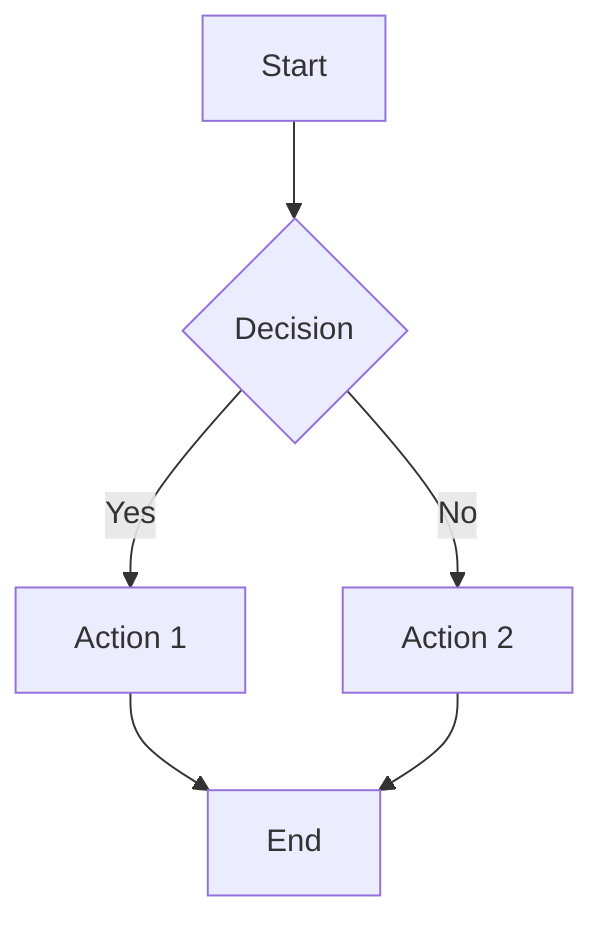

# Contributing to Enterprise CX Solution

Thank you for your interest in contributing to the Enterprise CX Solution! This guide provides detailed information on how to contribute effectively while maintaining the high standards of our documentation and code.

## 📋 Table of Contents

- [Getting Started](#getting-started)
- [Documentation Standards](#documentation-standards)
- [Code Standards](#code-standards)
- [GitHub Copilot Optimization](#github-copilot-optimization)
- [API Documentation](#api-documentation)
- [Testing Requirements](#testing-requirements)
- [Review Process](#review-process)
- [Style Guide](#style-guide)

## 🚀 Getting Started

### Prerequisites

1. **GitHub Account**: Ensure you have access to the repository
2. **Development Environment**: Set up according to [`03_DESIGN_DEVELOPMENT/04_Deployment_Runbooks/`](03_DESIGN_DEVELOPMENT/04_Deployment_Runbooks/)
3. **Tools**: Install required tools (see [Development Tools](#development-tools))

### Development Tools

- **IDE**: Visual Studio Code with GitHub Copilot extension
- **Containers**: Docker Desktop
- **Cloud CLIs**: Azure CLI, AWS CLI
- **Infrastructure**: Terraform, Azure Bicep
- **Testing**: Postman, Newman, pytest, xUnit

### Fork and Clone

1. Fork the repository to your GitHub account
2. Clone your fork locally:
   ```bash
   git clone https://github.com/YOUR-USERNAME/enterprise-cx-solution.git
   cd enterprise-cx-solution
   ```

## 📚 Documentation Standards

### Markdown Guidelines

#### Structure and Formatting
- Use consistent heading hierarchy (H1 for main title, H2 for sections, etc.)
- Include a table of contents for documents longer than 3 sections
- Use code blocks with language specification:
  ```markdown
  ```yaml
  # Example YAML content
  ```
- Employ consistent bullet point formatting (use `-` for lists)
- Add empty lines between sections for readability

#### GitHub Copilot Optimization
Documentation must be structured for optimal GitHub Copilot comprehension:

1. **Clear Headings**: Use descriptive headings that explain the purpose
2. **Structured Content**: Organize information in logical sections
3. **Code Examples**: Include practical examples with context
4. **Cross-References**: Link related documents using `[Link Text](path/to/document.md)`
5. **Metadata**: Include purpose, audience, and prerequisites at the top

#### Example Structure
```markdown
# Document Title

## Overview
Brief description of the document's purpose and scope.

## Prerequisites
- List of required knowledge
- Tools needed
- Dependencies

## Main Content
Detailed information organized in logical sections.

### Code Examples
```language
// Well-commented code examples
```

## See Also
- [Related Document](path/to/related.md)
- [External Resource](https://example.com)
```

### Diagramming Standards

#### Mermaid Diagrams (Preferred)
Use Mermaid for inline diagrams within Markdown files:

```markdown


#### Supported Diagram Types
- **Flowcharts**: Process flows and decision trees
- **Sequence Diagrams**: API interactions and workflows
- **Class Diagrams**: Data models and relationships
- **Architecture Diagrams**: System components and connections

#### PlantUML for Complex Diagrams
For complex diagrams not supported by Mermaid:
- Store PlantUML files in `DIAGRAMS_SOURCE/plantuml/`
- Include both `.puml` source and exported `.png` in documentation
- Reference diagrams using relative paths

### Documentation Templates

#### New Document Template
```markdown
# [Document Title]

## Overview
[Brief description of purpose and scope]

## Audience
[Target audience: Developers, Architects, Operations, etc.]

## Prerequisites
- [Required knowledge]
- [Tools needed]
- [Dependencies]

## [Main Section 1]
[Content organized in logical sections]

### [Subsection]
[Detailed information with examples]

## Examples
[Practical examples with context]

## Troubleshooting
[Common issues and solutions]

## See Also
- [Related documents]
- [External resources]

---
*Last updated: [Date] | Version: [Version]*
```

## 💻 Code Standards

### General Principles

1. **Clean Code**: Write self-documenting code with meaningful names
2. **SOLID Principles**: Follow SOLID design principles
3. **Error Handling**: Implement comprehensive error handling
4. **Security**: Never hardcode secrets or credentials
5. **Performance**: Consider performance implications
6. **Testing**: Write tests for all new functionality

### Language-Specific Standards

#### .NET/C#
```csharp
// Use XML documentation comments
/// <summary>
/// Retrieves customer profile by ID
/// </summary>
/// <param name="customerId">Unique customer identifier</param>
/// <returns>Customer profile or null if not found</returns>
public async Task<Customer?> GetCustomerAsync(Guid customerId)
{
    // Implementation with proper error handling
    try
    {
        return await _customerRepository.GetByIdAsync(customerId);
    }
    catch (Exception ex)
    {
        _logger.LogError(ex, "Failed to retrieve customer {CustomerId}", customerId);
        throw;
    }
}
```

#### Python
```python
"""
Customer profile management module.

This module provides functionality for managing customer profiles
in the Enterprise CX solution.
"""

async def get_customer(customer_id: str) -> Optional[Customer]:
    """
    Retrieve customer profile by ID.
    
    Args:
        customer_id: Unique customer identifier
        
    Returns:
        Customer profile or None if not found
        
    Raises:
        CustomerServiceError: If retrieval fails
    """
    try:
        return await customer_repository.get_by_id(customer_id)
    except Exception as e:
        logger.error(f"Failed to retrieve customer {customer_id}: {e}")
        raise CustomerServiceError(f"Customer retrieval failed") from e
```

#### JavaScript/TypeScript
```typescript
/**
 * Retrieves customer profile by ID
 * @param customerId - Unique customer identifier
 * @returns Promise resolving to customer profile or null
 */
export async function getCustomer(customerId: string): Promise<Customer | null> {
  try {
    return await customerRepository.getById(customerId);
  } catch (error) {
    logger.error(`Failed to retrieve customer ${customerId}:`, error);
    throw new CustomerServiceError('Customer retrieval failed');
  }
}
```

### Infrastructure as Code

#### Azure Bicep
```bicep
// Use descriptive parameter names and documentation
@description('Environment name (e.g., dev, staging, prod)')
param environmentName string

@description('Application name')
param applicationName string = 'enterprise-cx'

// Use consistent naming conventions
var resourceToken = toLower(uniqueString(subscription().id, environmentName))
var commonTags = {
  'azd-env-name': environmentName
  environment: environmentName
  application: applicationName
}

// Include comprehensive resource configurations
resource containerApp 'Microsoft.App/containerApps@2024-03-01' = {
  name: 'ca-${applicationName}-${environmentName}-${resourceToken}'
  location: location
  tags: commonTags
  properties: {
    // Detailed configuration
  }
}
```

#### Terraform
```hcl
# Use consistent variable naming and documentation
variable "environment_name" {
  description = "Environment name (e.g., dev, staging, prod)"
  type        = string
}

variable "application_name" {
  description = "Application name"
  type        = string
  default     = "enterprise-cx"
}

# Use local values for computed names
locals {
  resource_suffix = "${var.environment_name}-${random_string.resource_suffix.result}"
  common_tags = {
    Environment = var.environment_name
    Application = var.application_name
  }
}

# Include comprehensive resource configurations
resource "aws_lambda_function" "customer_processor" {
  function_name = "customer-processor-${local.resource_suffix}"
  role         = aws_iam_role.lambda_role.arn
  
  tags = local.common_tags
}
```

## 🤖 GitHub Copilot Optimization

### Repository Structure for AI
Organize code and documentation to maximize GitHub Copilot's effectiveness:

1. **Consistent Structure**: Follow the established directory structure
2. **Descriptive Names**: Use clear, descriptive file and function names
3. **Comprehensive Comments**: Include context in comments
4. **Type Annotations**: Use type hints in Python and TypeScript
5. **Documentation**: Maintain up-to-date README files

### Writing Copilot-Friendly Code

#### Function Documentation
```csharp
/// <summary>
/// Processes customer interaction and updates engagement metrics.
/// This function handles real-time customer interactions, updates the 
/// customer engagement score, and triggers appropriate follow-up actions.
/// </summary>
/// <param name="interaction">Customer interaction data</param>
/// <param name="cancellationToken">Cancellation token</param>
/// <returns>Updated engagement metrics</returns>
public async Task<EngagementMetrics> ProcessCustomerInteractionAsync(
    CustomerInteraction interaction, 
    CancellationToken cancellationToken = default)
{
    // Clear implementation steps
}
```

#### Context-Rich Comments
```python
# This function implements the intelligent routing algorithm that considers:
# 1. Customer segment (premium, standard, basic)
# 2. Agent skills and availability
# 3. Historical interaction patterns
# 4. Current queue lengths
# 5. Customer satisfaction scores
def route_customer_to_agent(customer_profile, available_agents, routing_context):
    """Route customer to the most appropriate agent based on multiple factors."""
    pass
```

### Using Copilot Instructions
Reference the repository-wide instructions in `.github/copilot-instructions.md`:

```markdown
@workspace How should I implement customer authentication in the API?
#file:.github/copilot-instructions.md
```

## 📋 API Documentation

### OpenAPI/Swagger Requirements

1. **Complete Specifications**: All APIs must have comprehensive OpenAPI specs
2. **Examples**: Include request/response examples
3. **Validation**: Define validation rules and constraints
4. **Error Responses**: Document all possible error responses
5. **Security**: Specify authentication and authorization requirements

### API Documentation Template
```yaml
openapi: 3.0.3
info:
  title: [API Name]
  description: |
    [Detailed description of the API's purpose and functionality]
  version: 1.0.0
  contact:
    name: API Support
    email: api-support@enterprise-cx.com

servers:
  - url: https://api.enterprise-cx.com/v1
    description: Production environment

security:
  - BearerAuth: []

paths:
  /resource:
    get:
      summary: [Brief description]
      description: [Detailed description]
      operationId: [camelCase operation ID]
      parameters:
        - name: [parameter name]
          in: [query/path/header]
          required: [true/false]
          schema:
            type: [type]
            example: [example value]
      responses:
        '200':
          description: Successful response
          content:
            application/json:
              schema:
                $ref: '#/components/schemas/Resource'
```

## 🧪 Testing Requirements

### Test Categories

1. **Unit Tests**: Test individual components in isolation
2. **Integration Tests**: Test component interactions
3. **End-to-End Tests**: Test complete user workflows
4. **Performance Tests**: Test system performance under load
5. **Security Tests**: Test security controls and vulnerabilities

### Test Standards

#### Unit Tests
```csharp
[Fact]
public async Task GetCustomerAsync_WithValidId_ReturnsCustomer()
{
    // Arrange
    var customerId = Guid.NewGuid();
    var expectedCustomer = new Customer { CustomerId = customerId };
    _mockRepository.Setup(r => r.GetByIdAsync(customerId))
                  .ReturnsAsync(expectedCustomer);

    // Act
    var result = await _customerService.GetCustomerAsync(customerId);

    // Assert
    Assert.NotNull(result);
    Assert.Equal(customerId, result.CustomerId);
}
```

#### Integration Tests (BDD)
```gherkin
Feature: Customer Profile Management
  As a customer service representative
  I want to manage customer profiles
  So that I can provide personalized service

  Scenario: Create new customer profile
    Given I have valid customer information
    When I create a new customer profile
    Then the customer should be saved successfully
    And the customer should have a unique identifier
```

### Test Coverage Requirements

- **Minimum Coverage**: 80% code coverage for all services
- **Critical Paths**: 100% coverage for security and payment flows
- **Documentation**: Test cases must be documented with clear descriptions
- **Maintainability**: Tests should be easy to understand and maintain

## 🔍 Review Process

### Pull Request Requirements

1. **Title**: Clear, descriptive title following conventional commits
2. **Description**: Detailed description of changes and rationale
3. **Testing**: Evidence of testing (screenshots, test results)
4. **Documentation**: Updated documentation for any changes
5. **Breaking Changes**: Clearly marked breaking changes

### Pull Request Template
```markdown
## Description
[Brief description of the changes]

## Type of Change
- [ ] Bug fix
- [ ] New feature
- [ ] Breaking change
- [ ] Documentation update
- [ ] Performance improvement
- [ ] Code refactoring

## Testing
- [ ] Unit tests pass
- [ ] Integration tests pass
- [ ] Manual testing completed
- [ ] Performance impact assessed

## Documentation
- [ ] README updated
- [ ] API documentation updated
- [ ] Code comments added/updated
- [ ] Changelog updated

## Screenshots/Evidence
[Include relevant screenshots or test results]

## Checklist
- [ ] Code follows style guidelines
- [ ] Self-review completed
- [ ] No hardcoded secrets
- [ ] Error handling implemented
- [ ] Logging added where appropriate
```

### Review Criteria

1. **Code Quality**: Follows coding standards and best practices
2. **Security**: No security vulnerabilities or hardcoded secrets
3. **Performance**: No performance regressions
4. **Documentation**: Adequate documentation and comments
5. **Testing**: Appropriate test coverage
6. **Compatibility**: Backward compatibility maintained

## 🎨 Style Guide

### Naming Conventions

#### Files and Directories
- Use kebab-case for file names: `customer-profile-api.yaml`
- Use PascalCase for class files: `CustomerService.cs`
- Use lowercase for directories: `customer_profile_api/`

#### Variables and Functions
- **C#**: PascalCase for methods, camelCase for parameters
- **Python**: snake_case for functions and variables
- **JavaScript/TypeScript**: camelCase for functions and variables

#### Constants
- Use UPPER_SNAKE_CASE for constants
- Group related constants in enums or static classes

### Code Organization

#### File Structure
```
service-name/
├── src/
│   ├── Controllers/
│   ├── Services/
│   ├── Models/
│   ├── Repositories/
│   └── Configuration/
├── tests/
│   ├── Unit/
│   ├── Integration/
│   └── Fixtures/
└── README.md
```

#### Import Organization
```csharp
// System imports first
using System;
using System.Collections.Generic;
using System.Threading.Tasks;

// Third-party imports
using Microsoft.Extensions.Logging;
using Microsoft.AspNetCore.Mvc;

// Local imports
using Enterprise.CX.Models;
using Enterprise.CX.Services;
```

### Comment Guidelines

#### Documentation Comments
```csharp
/// <summary>
/// Comprehensive description of the method's purpose and behavior.
/// Include information about when to use this method and any important
/// considerations or side effects.
/// </summary>
/// <param name="parameter">Description of the parameter</param>
/// <returns>Description of the return value</returns>
/// <exception cref="ArgumentException">When parameter is invalid</exception>
public async Task<Result> ProcessAsync(string parameter)
{
    // Implementation
}
```

#### Inline Comments
```csharp
// Explain complex business logic
if (customer.Segment == CustomerSegment.Premium && 
    customer.LastInteraction.AddDays(30) > DateTime.Now)
{
    // Premium customers with recent activity get priority routing
    return await RouteToVipQueueAsync(customer);
}
```

## 📞 Support and Questions

### Getting Help
- **Documentation Issues**: Create an issue with the `documentation` label
- **Code Questions**: Use GitHub Discussions
- **Architecture Questions**: Tag architecture team members
- **Urgent Issues**: Follow incident management procedures

### Resources
- [Architecture Documentation](02_ARCHITECTURE/)
- [API Specifications](03_DESIGN_DEVELOPMENT/02_API_Contracts/)
- [Deployment Guides](03_DESIGN_DEVELOPMENT/04_Deployment_Runbooks/)
- [Troubleshooting Guides](04_OPERATIONS_SUPPORT/02_Troubleshooting_Guides/)

---

*Thank you for contributing to the Enterprise CX Solution! Your contributions help us deliver exceptional customer experiences.*
