# High-Level Architecture

## Architecture Overview

The Enterprise CX Solution is built on a hybrid cloud architecture that leverages the strengths of both Azure and AWS platforms. The solution provides a unified customer experience platform that integrates contact center capabilities, AI-powered virtual assistants, and comprehensive customer data management.

```mermaid
graph TB
    subgraph "Customer Touchpoints"
        Phone[📞 Phone]
        Chat[💬 Web Chat]
        Email[📧 Email]
        SMS[📱 SMS]
        Social[🐦 Social Media]
        Mobile[📱 Mobile App]
    end

    subgraph "Azure Cloud Platform"
        ACS[Azure Communication Services]
        ACA[Azure Container Apps]
        APIM[API Management]
        AI[Azure AI Services]
        KeyVault[Key Vault]
        Monitor[Application Insights]
    end

    subgraph "AWS Cloud Platform"
        Connect[Amazon Connect]
        Lex[Amazon Lex]
        Lambda[AWS Lambda]
        S3[Amazon S3]
        DynamoDB[DynamoDB]
        CloudWatch[CloudWatch]
    end

    subgraph "Data Layer"
        CDP[Customer Data Platform]
        Analytics[Analytics Engine]
        DataLake[Data Lake]
    end

    subgraph "Integration Layer"
        EventHub[Event Hub]
        ServiceBus[Service Bus]
        APIGateway[API Gateway]
    end

    Phone --> Connect
    Chat --> ACS
    Email --> ACS
    SMS --> ACS
    Social --> ACS
    Mobile --> APIM

    Connect --> Lambda
    ACS --> ACA
    
    Lambda --> DynamoDB
    Lambda --> S3
    ACA --> AI
    
    Lex --> Lambda
    AI --> ACA
    
    EventHub --> CDP
    ServiceBus --> Analytics
    APIGateway --> DataLake
    
    ACA --> EventHub
    Lambda --> EventHub
    
    KeyVault --> ACA
    Monitor --> ACA
    CloudWatch --> Lambda
```

## Core Architecture Principles

### 1. Cloud-Native Design
- **Microservices Architecture**: Loosely coupled services with well-defined APIs
- **Container-First**: All services designed for container deployment
- **Event-Driven**: Asynchronous communication using event streaming
- **API-First**: RESTful APIs with OpenAPI specifications

### 2. Hybrid Cloud Strategy
- **Best-of-Breed**: Leverage optimal services from both Azure and AWS
- **Data Sovereignty**: Maintain data residency requirements
- **Vendor Flexibility**: Avoid single-cloud vendor lock-in
- **Cost Optimization**: Optimize costs across cloud providers

### 3. Security by Design
- **Zero Trust Architecture**: Verify every transaction and access request
- **Encryption Everywhere**: Data encrypted at rest and in transit
- **Identity-Based Access**: Managed identities and role-based access control
- **Compliance First**: Built-in compliance controls and audit trails

### 4. Scalability & Performance
- **Auto-Scaling**: Dynamic resource allocation based on demand
- **Global Distribution**: Multi-region deployment for low latency
- **Caching Strategy**: Intelligent caching at multiple layers
- **Performance Monitoring**: Real-time performance metrics and alerts

## Service Architecture

### Communication Services Layer

#### Azure Communication Services (ACS)
- **Purpose**: Unified communication platform for chat, email, and SMS
- **Components**:
  - Chat Service: Real-time messaging and chat rooms
  - Email Service: Transactional and marketing email delivery
  - SMS Service: Two-way SMS communication
  - Voice Service: VoIP calling capabilities

#### Amazon Connect
- **Purpose**: Cloud-based contact center platform
- **Components**:
  - Contact Flows: Visual workflow designer
  - Queue Management: Intelligent routing and prioritization
  - Agent Workspace: Unified agent interface
  - Real-time Analytics: Live dashboards and metrics

### AI & Intelligence Layer

#### Azure AI Services
- **Language Understanding**: Intent recognition and entity extraction
- **Speech Services**: Speech-to-text and text-to-speech
- **Computer Vision**: Image and video analysis
- **Document Intelligence**: Form and document processing

#### Amazon Lex
- **Conversational AI**: Natural language understanding and dialogue management
- **Intent Recognition**: Multi-turn conversation handling
- **Slot Filling**: Dynamic data collection from conversations
- **Integration**: Seamless integration with Amazon Connect

### Application Services Layer

#### Azure Container Apps (ACA)
- **Customer Profile API**: Unified customer data management
- **Interaction History Service**: Complete interaction tracking
- **Routing Engine**: Intelligent customer routing logic
- **Notification Service**: Multi-channel notification delivery

#### AWS Lambda Functions
- **Contact Flow Logic**: Custom business logic for Amazon Connect
- **Data Processing**: Real-time data transformation and enrichment
- **Integration Handlers**: Third-party system integration
- **Webhook Processors**: External event processing

### Data Architecture

#### Customer Data Platform (CDP)

#### Data Storage Strategy
- **Azure Data Lake**: Raw and processed data storage
- **Azure Cosmos DB**: Low-latency operational data
- **Amazon DynamoDB**: Session and state management
- **Azure SQL Database**: Structured transactional data

### Integration Architecture

#### Event-Driven Architecture

#### API Management
- **Azure API Management**: Centralized API gateway and security
- **Rate Limiting**: Protect backend services from overload
- **Authentication**: OAuth 2.0 and API key management
- **Monitoring**: API usage analytics and performance metrics

## Non-Functional Requirements

### Performance Requirements
| Metric | Target | Measurement |
|--------|--------|-------------|
| API Response Time | < 200ms (95th percentile) | Application Insights |
| Contact Routing Time | < 5 seconds | Amazon Connect metrics |
| Chat Response Time | < 3 seconds | Azure Communication Services |
| System Availability | 99.9% | Composite SLA monitoring |

### Scalability Requirements
| Component | Scaling Strategy | Capacity Target |
|-----------|------------------|-----------------|
| Container Apps | Horizontal auto-scaling | 100-1000 instances |
| Lambda Functions | Concurrent execution | 1000 concurrent executions |
| API Management | Consumption tier | 10,000 requests/minute |
| Data Storage | Elastic scaling | 10TB+ with automatic growth |

### Security Requirements
- **Data Classification**: PII, PHI, and financial data protection
- **Access Control**: Role-based access with principle of least privilege
- **Audit Logging**: Complete audit trail for all system interactions
- **Compliance**: GDPR, CCPA, SOC 2, and industry-specific requirements

### Disaster Recovery
- **Recovery Time Objective (RTO)**: < 4 hours
- **Recovery Point Objective (RPO)**: < 15 minutes
- **Backup Strategy**: Automated daily backups with point-in-time recovery
- **Geographic Redundancy**: Multi-region deployment with active-passive failover

## Technology Stack

### Azure Services
- **Compute**: Azure Container Apps, Azure Functions
- **Storage**: Azure Blob Storage, Azure Cosmos DB, Azure SQL Database
- **Integration**: Azure Service Bus, Azure Event Hub, Azure API Management
- **AI/ML**: Azure AI Services, Azure Machine Learning
- **Security**: Azure Key Vault, Azure Active Directory, Azure Security Center
- **Monitoring**: Azure Monitor, Application Insights, Log Analytics

### AWS Services
- **Contact Center**: Amazon Connect, Amazon Lex
- **Compute**: AWS Lambda, Amazon EC2
- **Storage**: Amazon S3, Amazon DynamoDB
- **Integration**: Amazon EventBridge, Amazon API Gateway
- **AI/ML**: Amazon Comprehend, Amazon Polly, Amazon Transcribe
- **Security**: AWS IAM, AWS Secrets Manager, AWS CloudTrail
- **Monitoring**: Amazon CloudWatch, AWS X-Ray

### Development Tools
- **Infrastructure as Code**: Azure Bicep, Terraform
- **CI/CD**: GitHub Actions, Azure DevOps
- **Containerization**: Docker, Kubernetes
- **API Documentation**: OpenAPI/Swagger, Postman
- **Testing**: Jest, xUnit, Postman/Newman
- **Monitoring**: Grafana, Prometheus, Datadog

---

*This architecture provides a comprehensive foundation for delivering exceptional customer experiences while maintaining security, scalability, and operational excellence.*
