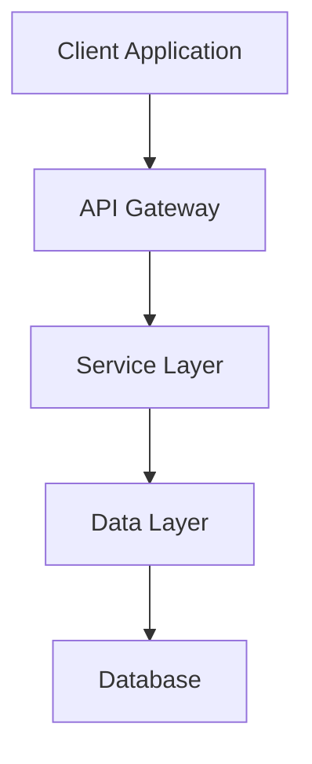
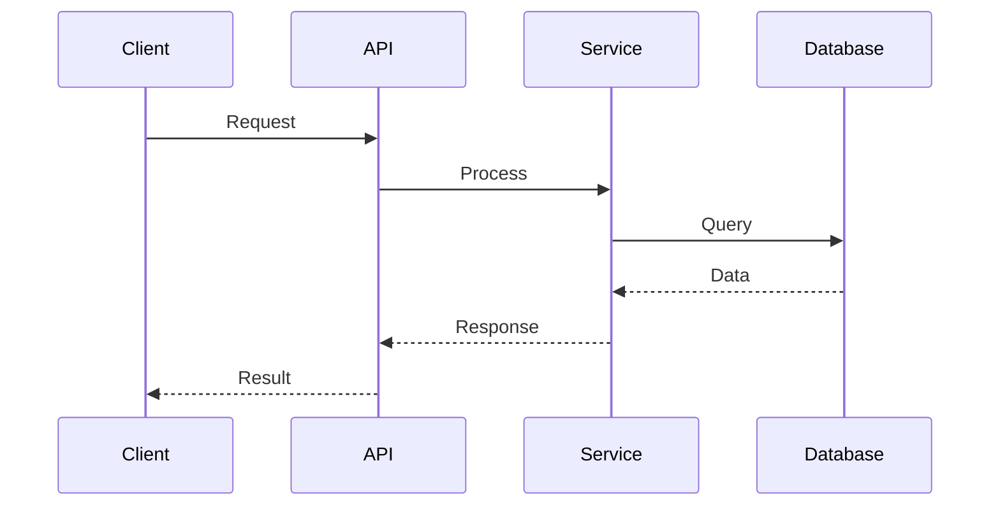
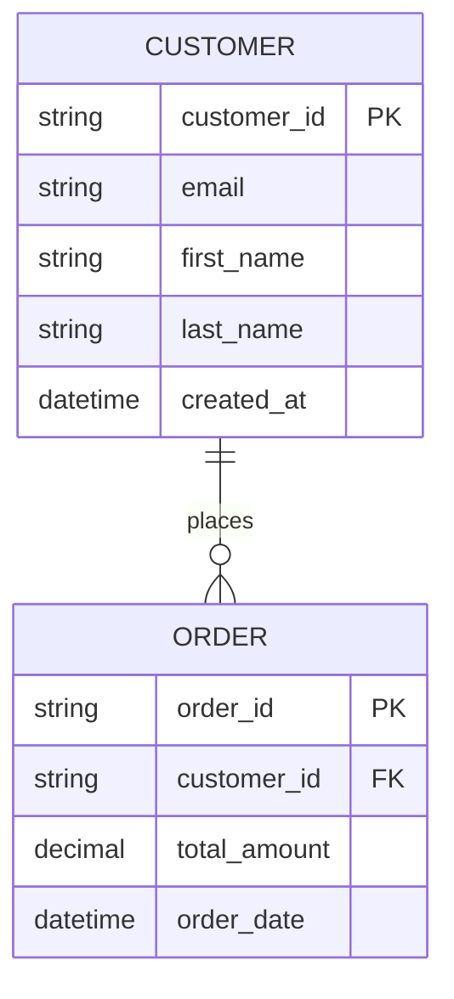

# Technical Design Document Template

## Document Information
- **Document Title**: [Title of the Technical Design]
- **Author**: [Author Name]
- **Date**: [Creation Date]
- **Version**: [Version Number]
- **Status**: [Draft | Review | Approved | Implemented]

## Overview

### Purpose
[Brief description of what this document covers and its intended audience]

### Scope
[Define what is included and what is excluded from this design]

### Audience
[List the intended readers: Developers, Architects, Operations, etc.]

## Problem Statement

### Current State
[Describe the current situation, existing systems, and their limitations]

### Problem Description
[Clearly articulate the problem that needs to be solved]

### Business Impact
[Explain the business impact of not solving this problem]

### Success Criteria
[Define what success looks like for this solution]

## Requirements

### Functional Requirements
1. [Requirement 1]: [Description]
2. [Requirement 2]: [Description]
3. [Requirement 3]: [Description]

### Non-Functional Requirements
| Requirement | Target | Measurement Method |
|-------------|--------|-------------------|
| Performance | [e.g., < 200ms response time] | [e.g., Application Insights] |
| Scalability | [e.g., 1000 concurrent users] | [e.g., Load testing] |
| Availability | [e.g., 99.9% uptime] | [e.g., System monitoring] |
| Security | [e.g., OAuth 2.0 authentication] | [e.g., Security audit] |

### Constraints
- [Technical constraints]
- [Business constraints]
- [Resource constraints]
- [Time constraints]

## Solution Architecture

### High-Level Architecture

### Component Overview
| Component | Responsibility | Technology |
|-----------|----------------|------------|
| [Component 1] | [Description] | [Technology stack] |
| [Component 2] | [Description] | [Technology stack] |
| [Component 3] | [Description] | [Technology stack] |

### Data Flow

## Detailed Design

### API Design
[Include OpenAPI specifications, endpoint definitions, request/response formats]

### Data Model

### Business Logic
[Describe key business rules, validation logic, and processing flows]

### Error Handling
[Define error handling strategy, error codes, and user-facing messages]

### Security Design
[Authentication, authorization, data encryption, and security controls]

## Implementation Details

### Technology Stack
- **Frontend**: [Technology and version]
- **Backend**: [Technology and version]
- **Database**: [Technology and version]
- **Infrastructure**: [Cloud provider and services]
- **Monitoring**: [Monitoring and logging tools]

### Development Approach
[Describe the development methodology, coding standards, and best practices]

### Testing Strategy
- **Unit Testing**: [Approach and coverage targets]
- **Integration Testing**: [Approach and scope]
- **End-to-End Testing**: [Approach and scenarios]
- **Performance Testing**: [Approach and load scenarios]

### Deployment Strategy
[Describe deployment approach, environments, and rollout plan]

## Alternatives Considered

### Alternative 1: [Name]
**Description**: [Brief description of the alternative]
**Pros**: 
- [Advantage 1]
- [Advantage 2]

**Cons**: 
- [Disadvantage 1]
- [Disadvantage 2]

**Decision**: [Why this alternative was not chosen]

### Alternative 2: [Name]
**Description**: [Brief description of the alternative]
**Pros**: 
- [Advantage 1]
- [Advantage 2]

**Cons**: 
- [Disadvantage 1]
- [Disadvantage 2]

**Decision**: [Why this alternative was not chosen]

## Risk Assessment

| Risk | Impact | Probability | Mitigation Strategy |
|------|--------|-------------|-------------------|
| [Risk 1] | [High/Medium/Low] | [High/Medium/Low] | [Mitigation approach] |
| [Risk 2] | [High/Medium/Low] | [High/Medium/Low] | [Mitigation approach] |
| [Risk 3] | [High/Medium/Low] | [High/Medium/Low] | [Mitigation approach] |

## Implementation Plan

### Phase 1: [Phase Name]
**Duration**: [Estimated duration]
**Deliverables**:
- [ ] [Deliverable 1]
- [ ] [Deliverable 2]
- [ ] [Deliverable 3]

### Phase 2: [Phase Name]
**Duration**: [Estimated duration]
**Deliverables**:
- [ ] [Deliverable 1]
- [ ] [Deliverable 2]
- [ ] [Deliverable 3]

### Phase 3: [Phase Name]
**Duration**: [Estimated duration]
**Deliverables**:
- [ ] [Deliverable 1]
- [ ] [Deliverable 2]
- [ ] [Deliverable 3]

## Monitoring and Observability

### Metrics to Track
- [Metric 1]: [Description and target]
- [Metric 2]: [Description and target]
- [Metric 3]: [Description and target]

### Logging Strategy
[Describe logging levels, log formats, and log aggregation]

### Alerting Rules
[Define alerting thresholds and notification procedures]

### Dashboards
[List dashboards to be created and their purpose]

## Assumptions and Dependencies

### Assumptions
- [Assumption 1]
- [Assumption 2]
- [Assumption 3]

### Dependencies
- [Dependency 1]: [Description and impact]
- [Dependency 2]: [Description and impact]
- [Dependency 3]: [Description and impact]

## Open Questions and Decisions

### Open Questions
1. [Question 1]: [Description and context]
2. [Question 2]: [Description and context]
3. [Question 3]: [Description and context]

### Decision Log
| Date | Decision | Rationale | Impact |
|------|----------|-----------|--------|
| [Date] | [Decision] | [Rationale] | [Impact] |
| [Date] | [Decision] | [Rationale] | [Impact] |

## References

### Related Documents
- [Document 1]: [Link and description]
- [Document 2]: [Link and description]
- [Document 3]: [Link and description]

### External References
- [Reference 1]: [Link and description]
- [Reference 2]: [Link and description]
- [Reference 3]: [Link and description]

## Appendices

### Appendix A: [Title]
[Additional technical details, code samples, or configurations]

### Appendix B: [Title]
[Additional diagrams, mockups, or specifications]

---

**Review and Approval**

| Role | Name | Date | Signature |
|------|------|------|-----------|
| Technical Lead | [Name] | [Date] | [Signature] |
| Architect | [Name] | [Date] | [Signature] |
| Product Owner | [Name] | [Date] | [Signature] |
| Security Review | [Name] | [Date] | [Signature] |

**Change History**

| Version | Date | Author | Changes |
|---------|------|--------|---------|
| 1.0 | [Date] | [Author] | Initial version |
| 1.1 | [Date] | [Author] | [Changes made] |

---

*This document follows the Enterprise CX Solution Technical Design Document Standard v1.0*
