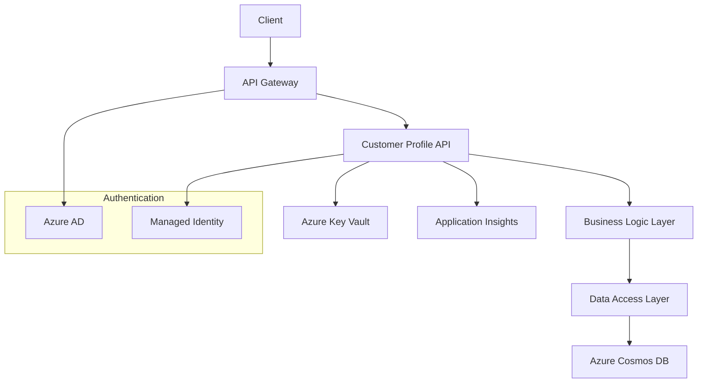
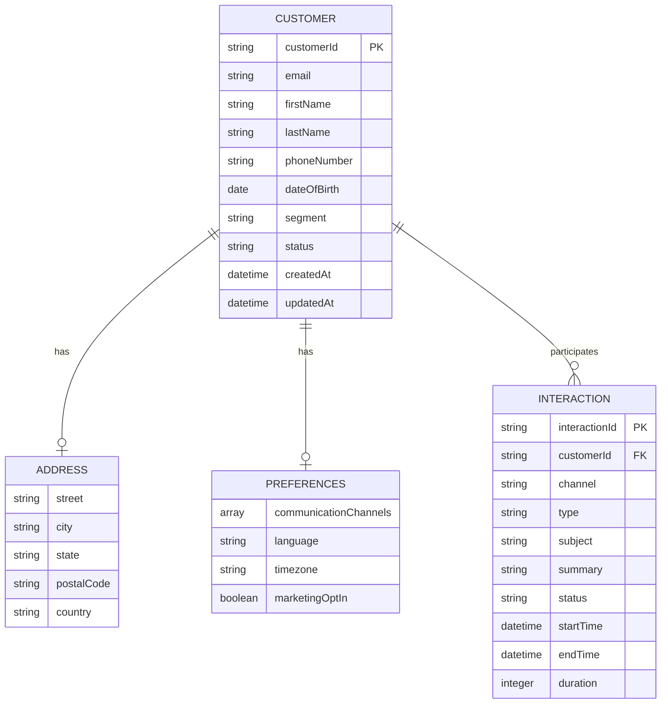

# Customer Profile API Service

## Overview
The Customer Profile API provides comprehensive customer data management capabilities for the Enterprise CX Solution. This service handles customer profile creation, updates, retrieval, and interaction history tracking.

## Features
- **Customer Management**: Create, read, update, and delete customer profiles
- **Interaction Tracking**: Record and retrieve customer interaction history
- **Preference Management**: Handle customer communication preferences
- **Segmentation**: Support for customer segment classification
- **Search and Filtering**: Advanced search capabilities with filtering options

## Technology Stack
- **Runtime**: .NET 8.0
- **Framework**: ASP.NET Core Web API
- **Database**: Azure Cosmos DB
- **Authentication**: Azure Active Directory / Managed Identity
- **Monitoring**: Application Insights
- **Containerization**: Docker

## API Documentation
The API follows OpenAPI 3.0 specification. View the complete API documentation:
- [OpenAPI Specification](../../03_DESIGN_DEVELOPMENT/02_API_Contracts/customer_profile_api.yaml)
- [Interactive API Documentation](https://api.enterprise-cx.com/swagger)

## Getting Started

### Prerequisites
- .NET 8.0 SDK
- Docker Desktop
- Azure CLI
- Visual Studio Code or Visual Studio

### Local Development Setup

1. **Clone the repository**
   ```bash
   git clone https://github.com/your-org/enterprise-cx-solution.git
   cd enterprise-cx-solution/CODE/services/customer_profile_api
   ```

2. **Configure environment variables**
   ```bash
   cp .env.template .env
   # Edit .env with your configuration
   ```

3. **Run with Docker**
   ```bash
   docker-compose up -d
   ```

4. **Run locally**
   ```bash
   dotnet restore
   dotnet run
   ```

### Environment Variables
| Variable | Description | Default |
|----------|-------------|---------|
| `ASPNETCORE_ENVIRONMENT` | Runtime environment | `Development` |
| `APPLICATIONINSIGHTS_CONNECTION_STRING` | Application Insights connection | - |
| `AZURE_CLIENT_ID` | Azure AD client ID | - |
| `CosmosDb__ConnectionString` | Cosmos DB connection string | - |
| `CosmosDb__DatabaseName` | Cosmos DB database name | `CustomerProfiles` |
| `KeyVault__VaultUri` | Key Vault URI | - |

## Architecture

### Service Architecture


### Data Model


## API Endpoints

### Customer Management
- `GET /api/v1/customers` - List customers with pagination and filtering
- `POST /api/v1/customers` - Create a new customer
- `GET /api/v1/customers/{id}` - Get customer by ID
- `PUT /api/v1/customers/{id}` - Update customer
- `DELETE /api/v1/customers/{id}` - Delete customer (soft delete)

### Interaction Management
- `GET /api/v1/customers/{id}/interactions` - Get customer interactions
- `POST /api/v1/customers/{id}/interactions` - Create new interaction
- `GET /api/v1/interactions/{id}` - Get interaction by ID
- `PUT /api/v1/interactions/{id}` - Update interaction

### Health Checks
- `GET /health` - Basic health check
- `GET /health/ready` - Readiness check
- `GET /health/live` - Liveness check

## Authentication and Authorization

### Authentication
The API uses Azure Active Directory for authentication with support for:
- **JWT Bearer tokens** for user authentication
- **Managed Identity** for service-to-service authentication
- **API Keys** for trusted system integration

### Authorization
Role-based access control (RBAC) with the following roles:
- **Customer Service Rep**: Read customer data, create interactions
- **Customer Service Manager**: Full customer management capabilities
- **System Administrator**: Full access including configuration
- **Read-Only**: View-only access for reporting systems

## Error Handling

### HTTP Status Codes
- `200 OK` - Successful request
- `201 Created` - Resource created successfully
- `400 Bad Request` - Invalid request data
- `401 Unauthorized` - Authentication required
- `403 Forbidden` - Access denied
- `404 Not Found` - Resource not found
- `409 Conflict` - Resource already exists
- `500 Internal Server Error` - Server error

### Error Response Format
```json
{
  "code": "INVALID_REQUEST",
  "message": "The request is invalid",
  "details": "Email address is required",
  "timestamp": "2023-06-15T14:30:00Z",
  "requestId": "req-123456"
}
```

## Performance and Scalability

### Performance Targets
- **Response Time**: < 200ms for 95% of requests
- **Throughput**: 1000 requests per second
- **Concurrent Users**: 500 simultaneous users
- **Database Query Time**: < 50ms for simple queries

### Scaling Strategy
- **Horizontal Scaling**: Auto-scale based on CPU and memory usage
- **Database Scaling**: Cosmos DB automatic scaling
- **Caching**: Redis cache for frequently accessed data
- **CDN**: Static content delivery optimization

## Monitoring and Observability

### Application Insights
- **Request Tracking**: All API requests and responses
- **Dependency Tracking**: Database calls and external services
- **Performance Counters**: Memory, CPU, and custom metrics
- **Exception Tracking**: Detailed error information

### Custom Metrics
- Customer creation rate
- Interaction volume by channel
- Average response time by endpoint
- Error rate by operation

### Logging
Structured logging using Serilog with log levels:
- **Information**: Normal operation events
- **Warning**: Potential issues or degraded performance
- **Error**: Error conditions that don't stop the application
- **Critical**: Error conditions that may cause the application to terminate

## Security

### Data Protection
- **Encryption at Rest**: All customer data encrypted in Cosmos DB
- **Encryption in Transit**: TLS 1.2+ for all communications
- **PII Handling**: Proper handling of personally identifiable information
- **Data Masking**: Sensitive data masked in logs and responses

### Security Headers
- Content Security Policy (CSP)
- HTTP Strict Transport Security (HSTS)
- X-Frame-Options
- X-Content-Type-Options

## Testing

### Unit Tests
- **Coverage Target**: 90% code coverage
- **Framework**: xUnit with Moq for mocking
- **Test Categories**: Controllers, Services, Repositories
- **Run Tests**: `dotnet test`

### Integration Tests
- **Database Tests**: Test with in-memory Cosmos DB emulator
- **API Tests**: End-to-end API testing
- **Authentication Tests**: Token validation and authorization
- **Run Tests**: `dotnet test --filter Category=Integration`

### Performance Tests
- **Load Testing**: Apache JMeter scripts in `/tests/performance/`
- **Stress Testing**: Identify breaking points
- **Endurance Testing**: Long-running stability tests

## Deployment

### Container Deployment
```dockerfile
FROM mcr.microsoft.com/dotnet/aspnet:8.0-alpine AS base
WORKDIR /app
EXPOSE 8080

FROM mcr.microsoft.com/dotnet/sdk:8.0-alpine AS build
WORKDIR /src
COPY ["CustomerProfileApi.csproj", "./"]
RUN dotnet restore "CustomerProfileApi.csproj"
COPY . .
RUN dotnet build "CustomerProfileApi.csproj" -c Release -o /app/build

FROM build AS publish
RUN dotnet publish "CustomerProfileApi.csproj" -c Release -o /app/publish

FROM base AS final
WORKDIR /app
COPY --from=publish /app/publish .
ENTRYPOINT ["dotnet", "CustomerProfileApi.dll"]
```

### Azure Container Apps
The service is deployed to Azure Container Apps with:
- **Auto-scaling**: 1-10 instances based on CPU/memory
- **Health Checks**: Liveness and readiness probes
- **Managed Identity**: For secure access to Azure resources
- **Environment Variables**: Configuration via Azure Key Vault

## Troubleshooting

### Common Issues

#### Database Connection Issues
```bash
# Check Cosmos DB connectivity
az cosmosdb show --name your-cosmos-db --resource-group your-rg

# Verify connection string in Key Vault
az keyvault secret show --vault-name your-keyvault --name CosmosDbConnectionString
```

#### Authentication Issues
```bash
# Check managed identity assignment
az identity show --ids /subscriptions/{subscription-id}/resourceGroups/{resource-group}/providers/Microsoft.ManagedIdentity/userAssignedIdentities/{identity-name}

# Verify token acquisition
curl -H "Metadata: true" "http://169.254.169.254/metadata/identity/oauth2/token?api-version=2018-02-01&resource=https://management.azure.com/"
```

#### Performance Issues
- Check Application Insights for slow queries
- Review Cosmos DB Request Units (RU) consumption
- Verify auto-scaling configuration
- Check memory and CPU usage patterns

### Logs and Diagnostics
```bash
# View container logs
docker logs customer-profile-api

# Check Application Insights
az monitor app-insights query --app your-app-insights --analytics-query "requests | where timestamp > ago(1h)"

# Azure Container Apps logs
az containerapp logs show --name your-container-app --resource-group your-rg
```

## Contributing

### Development Workflow
1. Create feature branch from `develop`
2. Implement changes with tests
3. Run code quality checks
4. Submit pull request with description
5. Code review and approval
6. Merge to `develop`

### Code Quality
- **Static Analysis**: SonarQube integration
- **Code Coverage**: Minimum 90% coverage
- **Security Scanning**: OWASP dependency check
- **Performance**: Load testing for significant changes

## Support

### Contact Information
- **Development Team**: dev-team@enterprise-cx.com
- **Operations Team**: ops-team@enterprise-cx.com
- **Architecture Team**: architecture@enterprise-cx.com

### Documentation
- [API Documentation](https://api.enterprise-cx.com/docs)
- [Architecture Documentation](../../02_ARCHITECTURE/)
- [Deployment Guides](../../03_DESIGN_DEVELOPMENT/04_Deployment_Runbooks/)
- [Troubleshooting Guides](../../04_OPERATIONS_SUPPORT/02_Troubleshooting_Guides/)

---

*Last updated: [Date] | Version: 1.0.0*
